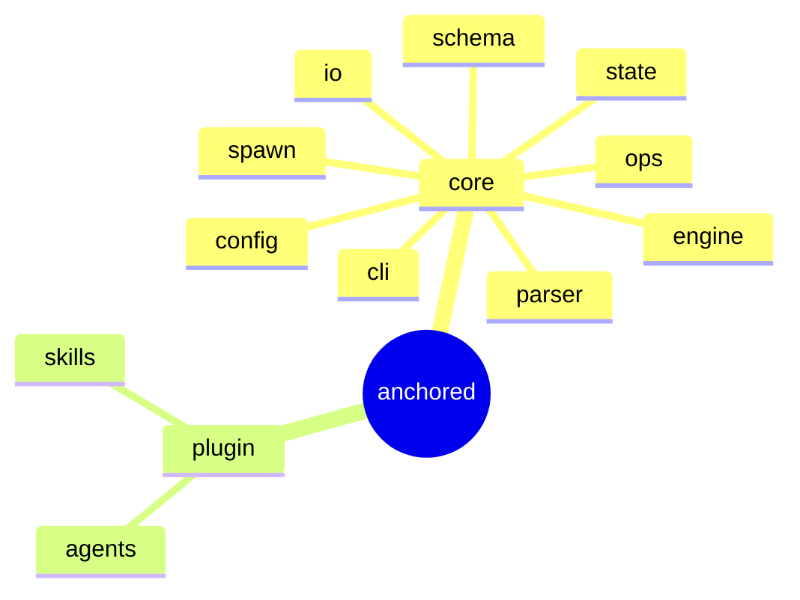

← Repo: [README](../README.md) · Design spec: [docs/design/](design/)

# anchored

Fractal framework for AI-driven work: **one** lifecycle form
(`plan → refine → build → wrap`) across **four self-similar tiers**
(`project ▸ epic ▸ task ▸ phase`). Two packages — **core** (the deterministic
engine + substrate + CLI) and **plugin** (the Claude Code integration, namespace
`a`).

| Area | Responsibility (scope boundary) |
|---|---|
| [core](core/_core.md) | Engine, substrate (state/schema/IO) and CLI. The entire **deterministic** mechanism — everything that is *not* AI lives here. |
| [plugin](plugin/_plugin.md) | Claude Code integration (namespace `a`): skills (`/a:plan` …) + agents (the AI workers). Thin layer over the CLI. |

> The binding model + the architecture decisions live in
> [docs/design/](design/) (fractal model, engine, default config, file structure,
> decision record).
