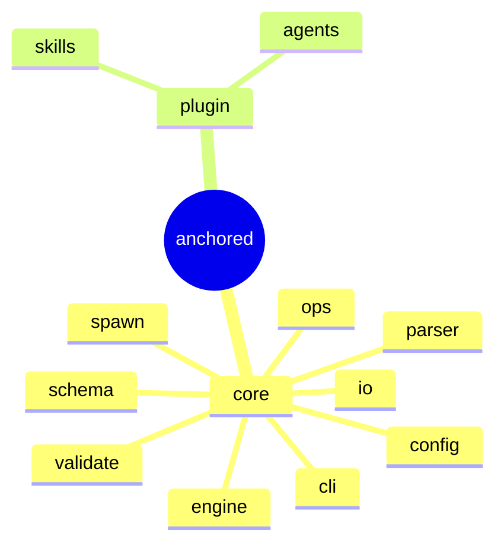

← Repo: [README](../README.md) · Design-Spec: [docs/design/](design/)

# anchored

Fraktales Framework für AI-getriebene Arbeit: **eine** Lebenszyklus-Form
(`plan → refine → build → wrap`) auf **vier selbstähnlichen Etagen**
(`project ▸ epic ▸ task ▸ phase`). Zwei Pakete — **core** (die deterministische
Engine + Substrat + CLI) und **plugin** (die Claude-Code-Integration, Namespace
`a`).

| Bereich | Verantwortung (Scope-Grenze) |
|---|---|
| [core](core/_core.md) | Engine, Substrat (State/Schema/IO) und CLI. Die gesamte **deterministische** Mechanik — alles, was *nicht* AI ist, lebt hier. |
| [plugin](plugin/_plugin.md) | Claude-Code-Integration (Namespace `a`): Skills (`/a:plan` …) + Agents (die AI-Worker). Dünne Schicht über der CLI. |

> Das verbindliche Modell + die Architektur-Entscheidungen liegen in
> [docs/design/](design/) (Fraktal-Modell, Engine, Default-Config, File-Struktur,
> Entscheidungs-Record).
