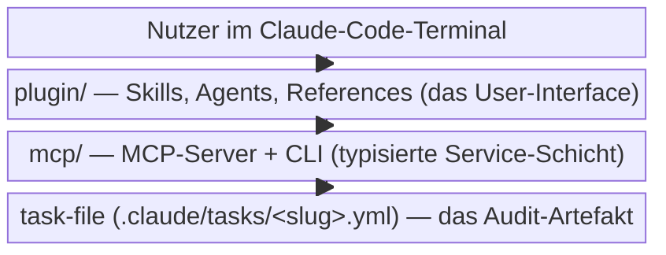

# anchored

> Long autonomous AI coding runs you can actually trust — every acceptance
> criterion needs concrete proof before the framework marks it done.

anchored ist ein **Evidence-anchored Task-Lifecycle für Claude Code**. Es zerlegt
eine Aufgabe in prüfbare Phasen mit Acceptance Criteria, treibt sie autonom durch
Quality-Gates und hält jede Entscheidung im Audit-fähigen Task-File fest. Das Repo
liefert zwei getrennt verteilte, aber co-evolvierende Pakete: das **Plugin**
(was Nutzer installieren) und den **MCP-Server** (die typisierte Service-Schicht
dahinter, die die Agents aufrufen).

| Bereich | Verantwortung (Scope-Grenze) |
|---|---|
| [plugin](plugin/_plugin.md) | Alles, was der Nutzer installiert und sieht: Lifecycle-Skills, denkende Agents, On-demand-References. Orchestriert — schreibt selbst nichts ins Task-File. |
| [mcp](mcp/_mcp.md) | Die typisierte Mutations-Engine hinter dem Plugin: MCP-Server + CLI über einer gemeinsamen `createOps`-Factory. Alles, was das Task-File tatsächlich liest/schreibt/validiert, gehört hierher. |

Die beiden Pakete teilen sich das **Task-File-Schema** als Vertrag: der Plugin-Agent
formuliert Inhalte, der MCP-Server persistiert sie atomar und schema-validiert.
