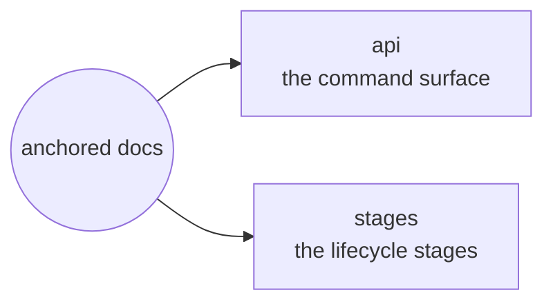

# anchored — docs

anchored is a **fractal task lifecycle** for AI-assisted engineering: **epic ▸ task ▸ phase**, each running the same four stages **plan → refine → build → wrap**. Integrity lives in the substrate, not in a step — no acceptance criterion reaches `done` without evidence.

## Areas

| Area | What's there |
| --- | --- |
| [api](api.md) | Every command you can run — the `anchored <tier> <verb> [slug]` CLI grammar and the `/a:*` plugin slash commands. |
| [stages](stages/_stages.md) | The lifecycle stages — setup, plan, refine, build, wrap — and what each one does on a tier. |
