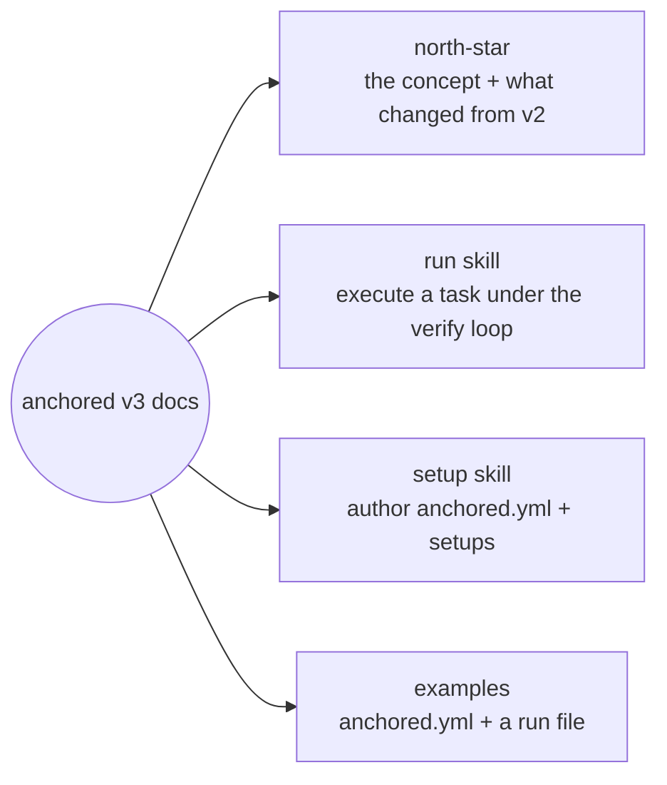

# anchored v3 — docs

anchored v3 is a **verification gate for AI work**: the AI works the way it always works — anchored is the boundary it cannot pass without an independent validator authoring evidence that the goal was actually reached. One skill, one run file, one CLI, one validator. No workflow engine.

## Areas

| Area | What's there |
| --- | --- |
| [north-star](design/north-star.md) | The whole model on one page — the loop, mechanism vs. policy, gates, the validator contract, and what got deleted from v2 and why. |
| [run](run.md) | The one execution skill — anchor a goal, work freely, validate at gates, close on green. |
| [setup](setup.md) | The onboarding skill — builds the project's `anchored.yml` and its named setups (`frontend`, `backend`, `release`, …). |
| [examples](examples/anchored.yml) | A commented `anchored.yml` and a commented run file (`.claude/anchored/<slug>.yml`) showing every field in play. |

## The one-sentence pitch

> You plan like you always do, the AI works like it always does — anchored freezes your plan, derives criteria from it, and an independent validator must prove each one at the **gates**. Nothing reaches `done` without evidence, and every checked-off task means *proven*, not *claimed*.
