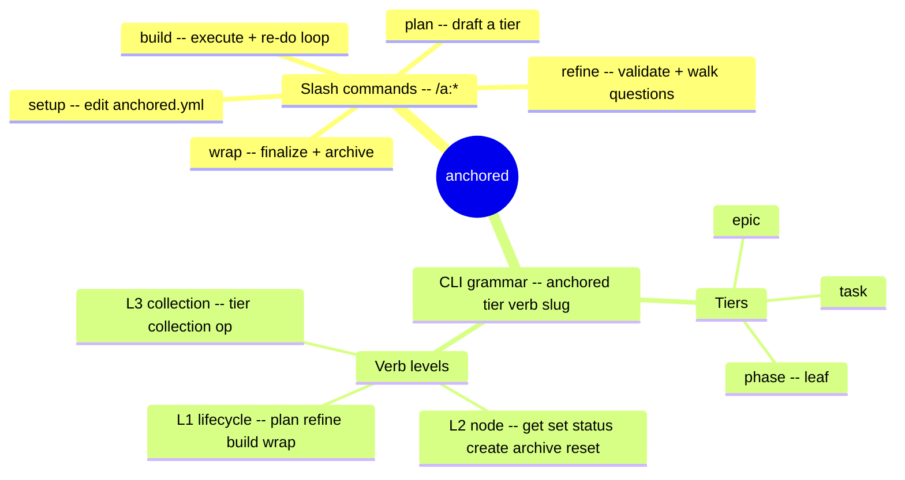

← [docs](_docs.md)

# anchored — commands

anchored gives you one CLI grammar — **`anchored <tier> <verb> [slug]`** — over a three-tier fractal (**epic ▸ task ▸ phase**). You reach it two ways: through five plugin slash commands under namespace `a` (the conversational front end), or by calling the raw `anchored` CLI directly over Bash. Both drive the same engine; the slash commands just call the CLI underneath.



## Slash commands

The shipped plugin commands (namespace `a`, fallback `anc`). Each is a conversational wrapper around the CLI.

| Command | What it does |
| --- | --- |
| `/a:setup` | Create or extend the project's `anchored.yml` — add or edit custom lifecycle steps, gate instructions, per-tier `retry_limit` + stop-conditions, custom phase fields, and branch/commit/PR or test-driven-development wiring. Also the onboarding entry when any `/a:*` skill runs with no `anchored.yml` yet. |
| `/a:plan` | Brainstorm a raw description into a drafted plan with phases + testable acceptance criteria; classifies the tier when omitted and surfaces open questions. Invoked as `/a:plan <epic\|task\|phase>? <description>`. |
| `/a:refine` | Validate a drafted plan against the current code + rules, then walk the open questions with you before build. Invoked as `/a:refine <slug>`. |
| `/a:build` | Execute the build stage of a tier node — orchestrate its children to completion, drive the failures-driven re-do loop, transition status `build → wrap`. Invoked as `/a:build <slug>`. |
| `/a:wrap` | Finalize a node whose build is complete — review + summarize (leaf/task) or roll-up (epic), then archive on `done`. Invoked as `/a:wrap <slug>`. |

## The CLI grammar

One line covers every operation:

```
anchored <tier> <verb> [slug] [args]
```

- **`<tier>`** is one of `epic`, `task`, `phase`.
- **`[slug]`** carries the nesting — a phase lives at `my-epic/login/setup`.
- **`<verb>`** spans three levels: a lifecycle stage, a node verb, or a collection op.

### Level 1 — lifecycle (the four stages)

The fractal lifecycle — `plan · refine · build · wrap` — is identical on every tier; a stage is just a verb. `phase` is the leaf (build without `each`); nesting lives entirely in the slug.

```
anchored epic plan "auth system"
anchored task refine my-epic/login
anchored task build my-epic/login
anchored phase build my-epic/login/setup
anchored task wrap my-epic/login
```

### Level 2 — the node itself

Read and mutate a single node: `get` · `set <field> <value>` · `status <to>`, plus `create` · `archive` · `reset`. The `wrap` stage calls `archive` on `done` to move the node into `_archive/`.

```
anchored task get my-epic/login
anchored task status my-epic/login build
anchored task set my-epic/login title "…"
```

### Level 3 — collections (`<tier> <collection> <op>`)

A sub-resource plus an op. The pattern is regular: an agent that learns `<tier> <collection> <op>` derives every command. The `ac → done` write is gated by the evidence invariant in the schema — no acceptance criterion reaches `done` without evidence.

```
anchored phase ac add my-epic/login/setup "…"
anchored phase ac done my-epic/login/setup a1
anchored phase ac evidence my-epic/login/setup a1 "…"
anchored phase ac fail my-epic/login/setup a1 "…"
anchored task question add my-epic/login "…"
anchored epic child add my-epic new-task [goal] [deps]
anchored epic child next my-epic
```

## Tiers & collections

For what each tier is *for* and can do — not just its commands — see the [tier portraits](tier/_tier.md) (epic · task · phase).

| Tier | Lifecycle | Collections |
| --- | --- | --- |
| `epic` | `plan refine build wrap` | child · acceptance · question · concern |
| `task` | `plan refine build wrap` | phase · question · concern |
| `phase` | (leaf — no stages) | ac · rule |
