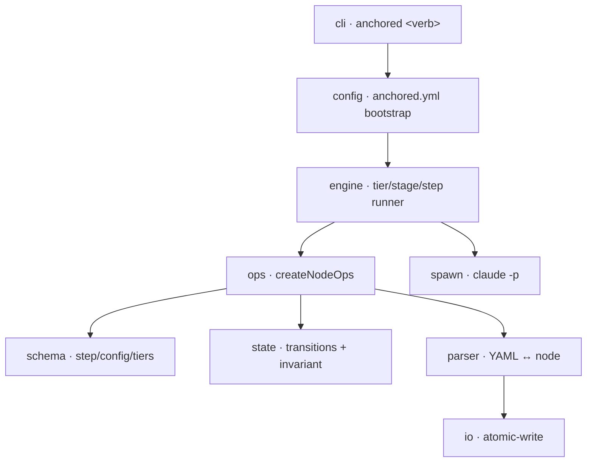

← [anchored](../_anchored.md)

# core

The CLI/engine package — the **deterministic** half of anchored. Loads the
config, drives the fractal lifecycle, mutates the node files atomically, and
enforces the integrity invariant. AI work is only triggered as an effect via
`spawn` (engine = code, AI = effect).

| Area | Responsibility (scope boundary) |
|---|---|
| [config](config/_config.md) | Bootstrap of the base dependency: `merge(default-template, user anchored.yml)` → `effectiveConfig`, once at startup. |
| [engine](engine/_engine.md) | The fractal factory engine — drives `plan/refine/build/wrap` per node; `each` recurses into the child tier. |
| [ops](ops/_ops.md) | Tier-generic op core: create/read/status/children/questions/log over *any* node. |
| [schema](schema/_schema.md) | Zod schemas: step grammar, `anchored.yml`, tier descriptors. |
| [state](state/_state.md) | State machine (forward-only) + the **hard invariant** (no `done` without `evidence`). |
| [parser](parser/_parser.md) | YAML ↔ node (two parse profiles), block-scalar render + schema directive. |
| [io](io.md) | `atomic-write` (lock + mkdir + POSIX rename). Single file. |
| [spawn](spawn.md) | Execution substrate: `claude -p` per task file, phases in-process. Single file. |
| [cli](cli/_cli.md) | The `anchored` command — sole transport (no MCP). `plan/refine/build/wrap` + generic node verbs. |
| [wiring](wiring.md) | Composition root: `index.ts` (pure factory `createAnchored`) + `bin.ts` (sole effect site). Wires the substrate in deps-graph order. |

> **YAGNI**: The module pages reflect the **already decided** design
> (worked in from [docs/design/](../design/)) — only as deep as settled.
> Deeper implementation details (micro: schemas, signatures, enums) follow **with the code**,
> not pre-built.
