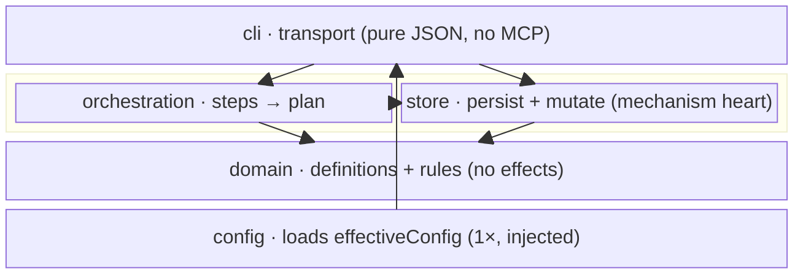

← [anchored](../_anchored.md)

# core

The CLI package — the **deterministic** half of anchored. Loads the config,
resolves the config-driven step plans, mutates the node files atomically, and
enforces the integrity invariant. It exposes the lifecycle as CLI verbs; the
in-session skill orchestrates `plan → refine → build → wrap` over them (the
headless engine-run chain was removed — a `claude -p` subprocess can not reach
the session's Task tool).

`core/src` is laid out **domain-oriented**, not as a technical layer-cake. Three
layers carry the substance — `domain/` (what things *are*), `store/` (how they
are *persisted*), `orchestration/` (how they *run*) — flanked by `config/` (what
they are *built from*) and `cli/` (how the outside *reaches in*). Reading a
folder name tells you which layer you are in and what it may depend on.

| Area | Responsibility (scope boundary) |
|---|---|
| [domain](domain/_domain.md) | The definition layer — what a tier *is*, the lifecycle stages + forward-only transitions, the step grammar, the hard substrate invariant, the config *schema*. Pure knowledge, **no effects**. Everything that is a fact about the model, not a mutation or an effect, belongs here. |
| [store](store/_store.md) | The mechanism heart — the read-modify-write kernel, the slug→tier→op router, the validate surface, the YAML↔node codec, atomic-write IO. Everything that *persists or mutates* a node belongs here. |
| [orchestration](orchestration/_orchestration.md) | The flow layer — resolve the config-driven step sequence per tier/stage and map step → worker. Everything that turns config into a *runnable plan* belongs here. |
| [config](config/_config.md) | The I/O-near loader — `merge(default-template, user anchored.yml)` → `effectiveConfig`, once at startup, injected as `deps.config`. Loading, deliberately separate from the config *schema* (which is `domain/config-schema`). |
| [cli](cli/_cli.md) | The sole transport (no MCP) — `cli.ts` is pure JSON dispatch + envelope; `commands/{stage,node,lifecycle}` carry the verbs. Everything about *how a caller reaches the ops* belongs here, nothing about what the ops mean. |
| [wiring](wiring.md) | Composition root — `index.ts` (pure factory `createAnchored`) + `bin.ts` (sole effect site). Wires the layers in deps-graph order. |

## Why this split

Three dividing lines decide where a thing lives:

1. **Definition vs. wiring** — `domain/config-schema` defines *what config is*;
   `config/` *loads* it (I/O-near). The schema is domain knowledge; loading is an
   effect. So `config/` is not part of `domain/`.
2. **Mechanism vs. policy** — `domain/`, `store/`, the state machine and the
   invariant are deterministic, fixed code (mechanism). *What* happens in each
   stage (the step sequences, the fields) is policy, living in `anchored.yml` +
   the default template, not in these folders.
3. **Effects behind seams** — AI is an effect behind `deps.spawn`, the
   filesystem behind `store/io`, the transport behind `cli`. The deep layers
   (`domain/`) stay effect-free and therefore purely testable — exactly what the
   [factory-function](../../.claude/rules/factory-functions.md) rule enforces.

The dependency direction is **forward-only**: `cli → orchestration / store →
domain`. `domain/` imports from nobody; `cli/` may import from everyone. A type
that once crossed this line (the `NodeOpsFacade` imported *up* from cli) was
moved down to its rightful layer (`store/node-router`) so the arrows only ever
point inward.

> **YAGNI**: The module pages reflect the **already decided** design (worked in
> from [docs/design/](../design/)) — only as deep as settled. Deeper detail
> (micro: schemas, signatures, enums) follows **with the code**, not pre-built.
