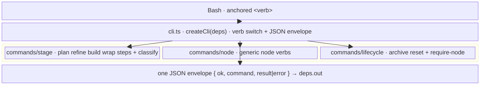

← [core](../_core.md)

# cli

**BLUF:** `cli/` is the **sole transport** — the `anchored` command, callable via Bash
from the main session *and* from subagents/headless, no MCP. `cli.ts` is a **pure
factory** (`createCli(deps) → { run(argv) }`) that does **only two things**: dispatch
the verb and wrap every outcome in the JSON envelope `{ ok, command, result|error }`.
All domain logic lives **outside** the transport under `commands/` — even the
stage-classify tripwire (`slugFromInput` + `classifyTier`) was pulled out into
`commands/stage/classify.ts` so `cli.ts` and the per-verb command files stay
arg-parsing + dispatch only.

| Area (link) | Responsibility (scope boundary) |
|---|---|
| `cli.ts` | The factory: verb switch, central error-catch, the `{ ok, command, result\|error }` envelope. No process access (that is the bin entry), no domain logic. |
| [commands](commands/_commands.md) | Everything the verbs *do* — the three command groups (`stage` / `node` / `lifecycle`) plus the pulled-out pure helpers. |

> Lazy-init adds a `Bash(anchored *)` allowlist entry in
> `.claude/settings.local.json` → no permission prompt per call.
