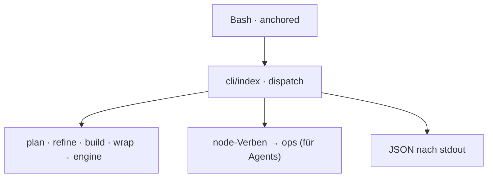

← [core](../_core.md)

# cli

Der `anchored`-Befehl — der **einzige Transport** (kein MCP). Über Bash aus der
Main-Session *und* aus Subagents/headless aufrufbar; Output als **JSON**.

| Unit | Verantwortung |
|---|---|
| [commands](commands.md) | Die Verb-Fläche: Stage-Verben (`plan/refine/build/wrap`) + generische Node-Verben. |

> Lazy-init legt einen `Bash(anchored *)`-Allowlist-Eintrag in
> `.claude/settings.local.json` → keine Permission-Prompts pro Aufruf.
