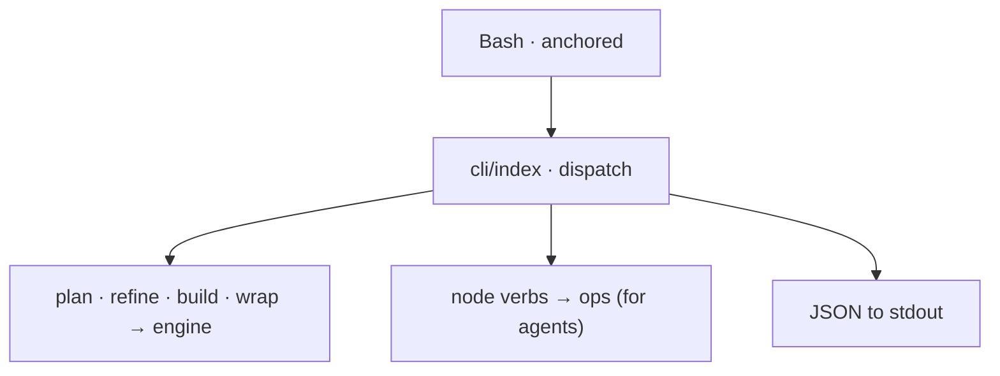

← [core](../_core.md)

# cli

The `anchored` command — the **only transport** (no MCP). Callable via Bash from
the main session *and* from subagents/headless; output as **JSON**.

| Unit | Responsibility |
|---|---|
| [commands](commands.md) | The verb surface: stage verbs (`plan/refine/build/wrap`) + generic node verbs. |

> Lazy-init adds a `Bash(anchored *)` allowlist entry in
> `.claude/settings.local.json` → no permission prompts per call.
