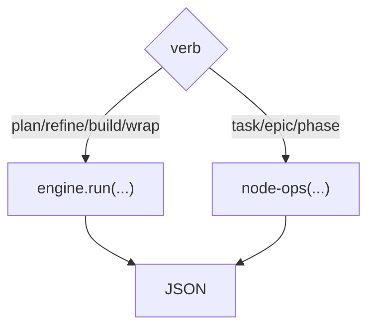

← [cli](_cli.md)

# commands

Die Verb-Fläche des `anchored`-Befehls. Zwei Gruppen: **Stage-Verben** (treiben
den Lifecycle über die [engine](../engine/_engine.md)) und **Node-Verben**
(direkte Ops, v.a. von Agents genutzt).

## Was

- **Stage-Verben:**
  - `anchored plan <epic|task|phase>? <prosa|path>` — strukturiert; ohne Tier →
    discover + classify.
  - `anchored refine <slug>` · `anchored build <slug>` · `anchored wrap <slug>` —
    Tier wird aus dem Node abgeleitet.
- **Node-Verben** (per-Tier-Surfaces über [node-ops](../ops/node-ops.md)):
  `anchored task|epic|phase <read|set-status|add-evidence|append-log|…>`.
- Alle geben JSON aus; Mutationen laufen ausschließlich hierüber (nicht via
  direktem Edit am File).

## Wie

