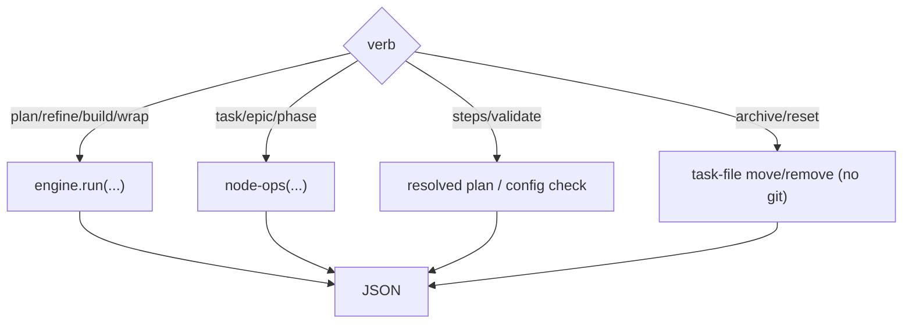

← [cli](_cli.md)

# commands

The verb surface of the `anchored` command. **Stage verbs** drive the lifecycle via
the [engine](../engine/_engine.md), **node verbs** are direct ops (used mainly by
agents), plus **inspect** and **lifecycle verbs**.

## What

- **Stage verbs:**
  - `anchored plan <epic|task|phase>? <prose|path>` — structured; without a tier →
    discover + classify.
  - `anchored refine <slug>` · `anchored build <slug>` · `anchored wrap <slug>` —
    the tier is derived from the node.
- **Inspect verbs:**
  - `anchored steps <tier> <stage>` — outputs the resolved, config-driven
    step plan of a tier×stage (what the skill orchestrates).
  - `anchored validate` — checks the merged `anchored.yml`: resolves each tier×stage
    + lists the custom fields.
- **Lifecycle verbs (files only, no git):**
  - `anchored archive <slug>` — moves the task file to `archive/<slug>.yml`.
  - `anchored reset <slug>` — removes the task file (initial state).
- **Node verbs** (per-tier surfaces over [node-ops](../ops/node-ops.md)):
  `anchored task|epic|phase <read|set-status|add-evidence|append-log|…>`.
- All output JSON; mutations run exclusively through here (not via a
  direct edit on the file). The command touches git **nowhere** — even archive/reset
  only move files; version-control lives in the `run` steps of `anchored.yml`.

## How

