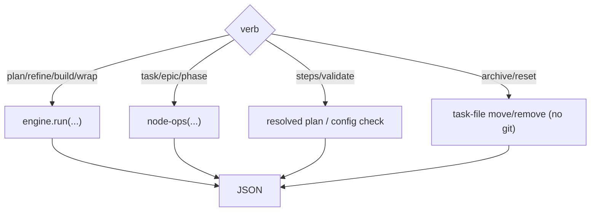

← [cli](_cli.md)

# commands

Die Verb-Fläche des `anchored`-Befehls. **Stage-Verben** treiben den Lifecycle über
die [engine](../engine/_engine.md), **Node-Verben** sind direkte Ops (v.a. von
Agents genutzt), dazu **Inspect-** und **Lifecycle-Verben**.

## Was

- **Stage-Verben:**
  - `anchored plan <epic|task|phase>? <prosa|path>` — strukturiert; ohne Tier →
    discover + classify.
  - `anchored refine <slug>` · `anchored build <slug>` · `anchored wrap <slug>` —
    Tier wird aus dem Node abgeleitet.
- **Inspect-Verben:**
  - `anchored steps <tier> <stage>` — gibt den aufgelösten, config-getriebenen
    Step-Plan einer Tier×Stage aus (was der Skill orchestriert).
  - `anchored validate` — prüft die gemergte `anchored.yml`: löst jedes Tier×Stage
    auf + listet die Custom-Felder.
- **Lifecycle-Verben (nur Files, kein Git):**
  - `anchored archive <slug>` — verschiebt das Task-File nach `archive/<slug>.yml`.
  - `anchored reset <slug>` — entfernt das Task-File (Ausgangszustand).
- **Node-Verben** (per-Tier-Surfaces über [node-ops](../ops/node-ops.md)):
  `anchored task|epic|phase <read|set-status|add-evidence|append-log|…>`.
- Alle geben JSON aus; Mutationen laufen ausschließlich hierüber (nicht via
  direktem Edit am File). Git fasst der Befehl **nirgends** an — auch archive/reset
  bewegen nur Files; VCS lebt in den `run`-Steps der `anchored.yml`.

## Wie

