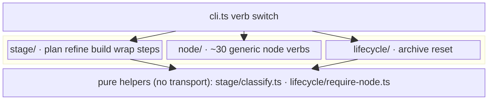

← [cli](../_cli.md)

# commands

**BLUF:** the verb surface, split into three groups by what the verbs *touch*.
`cli.ts` dispatches a verb to one of these; the group function maps it to a
`deps.nodeOps` facade call (or, for `steps`/`plan`, the resolved step plan) and
returns a plain result — `cli.ts` wraps it in the JSON envelope. The CLI never
spawns agents and never runs the lifecycle: stage verbs return an **orchestration
plan** for the in-session skill to drive.

| Area (link) | Responsibility (scope boundary) |
|---|---|
| [stage](stage/_stage.md) | `plan`/`refine`/`build`/`wrap` + `steps`; the shared `runStage` helper; the pulled-out `classify.ts` pure helpers. Returns the orchestration plan, never spawns. |
| [node](node/_node.md) | One generic, tier-generic verb table (~30 verbs) agents drive via Bash; each verb = one `nodeOps` facade call. |
| [lifecycle](lifecycle/_lifecycle.md) | `archive`/`reset` — file-only cleanup of a finished/abandoned task; the shared `require-node` existence guard. Never touches git. |
