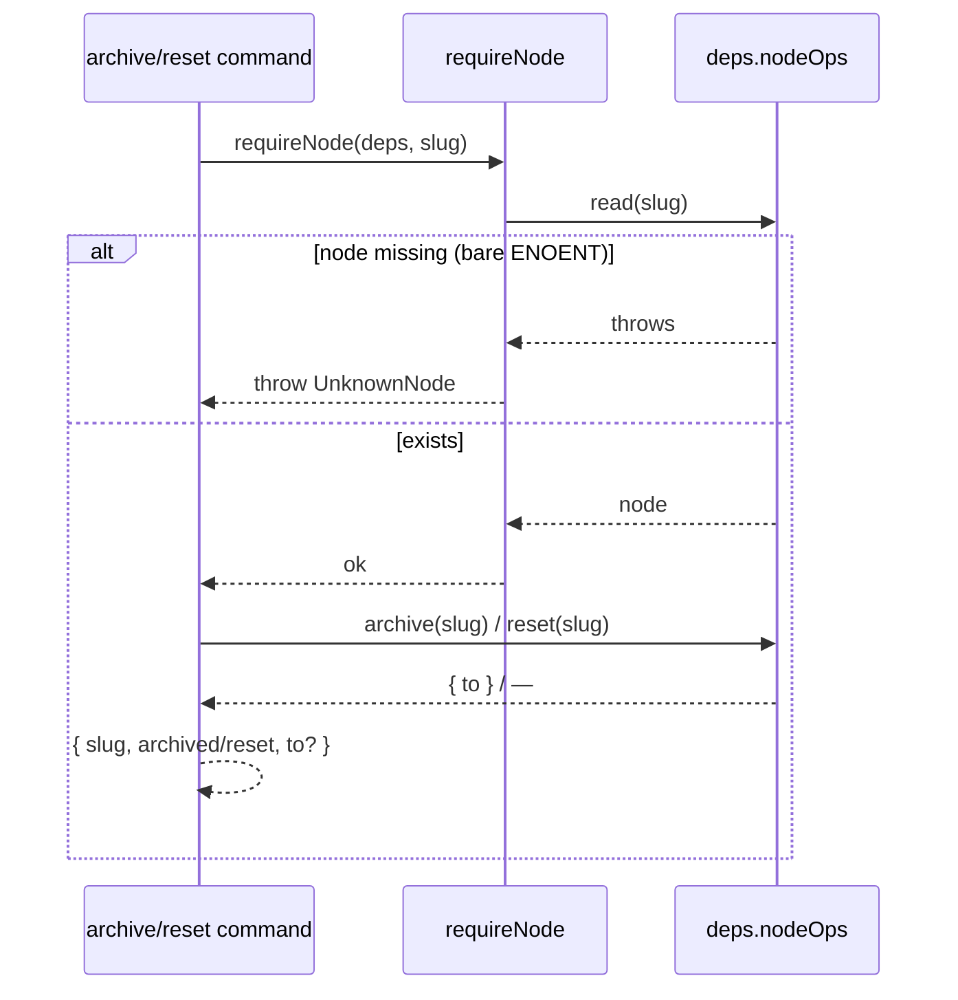

← [commands](../_commands.md)

# lifecycle

**BLUF:** two cleanup verbs for a finished or abandoned task — `archive` (freeze:
move the task-file into `archive/<slug>.yml`) and `reset` (undo: remove the
task-file). Both are **file-only** substrate ops via the facade and **never touch
git** — deleting a feature branch is the user's own concern, not a framework
side-effect. Both prove the node exists first via the shared `require-node` guard.

## Was

- **`archive <slug>`** → `requireNode` then `nodeOps.archive(slug)`; returns
  `{ slug, archived: true, to }` where `to` is the `archive/` destination path.
- **`reset <slug>`** → `requireNode` then `nodeOps.reset(slug)`; returns
  `{ slug, reset: true }`.
- **Both demand a slug** — absent → `MissingArgument`.
- **`require-node` is a pure shared helper.** It reads the node to prove it exists
  *before* any destructive file step; a raw read miss (ENOENT, bare `Error`) is
  mapped to a typed `UnknownNode` (so the caller gets a clean envelope, never a
  filesystem stack), while an already-typed substrate error is re-thrown as-is. No
  hidden state, no imported effect — the only concern shared between the two verbs.

## Wie

## Warum

Cleanup must never silently mutate version-control — file-only keeps the framework's
side-effects bounded to the task-files. Guarding existence before a destructive op
means a typo'd slug fails loud and changes nothing.
