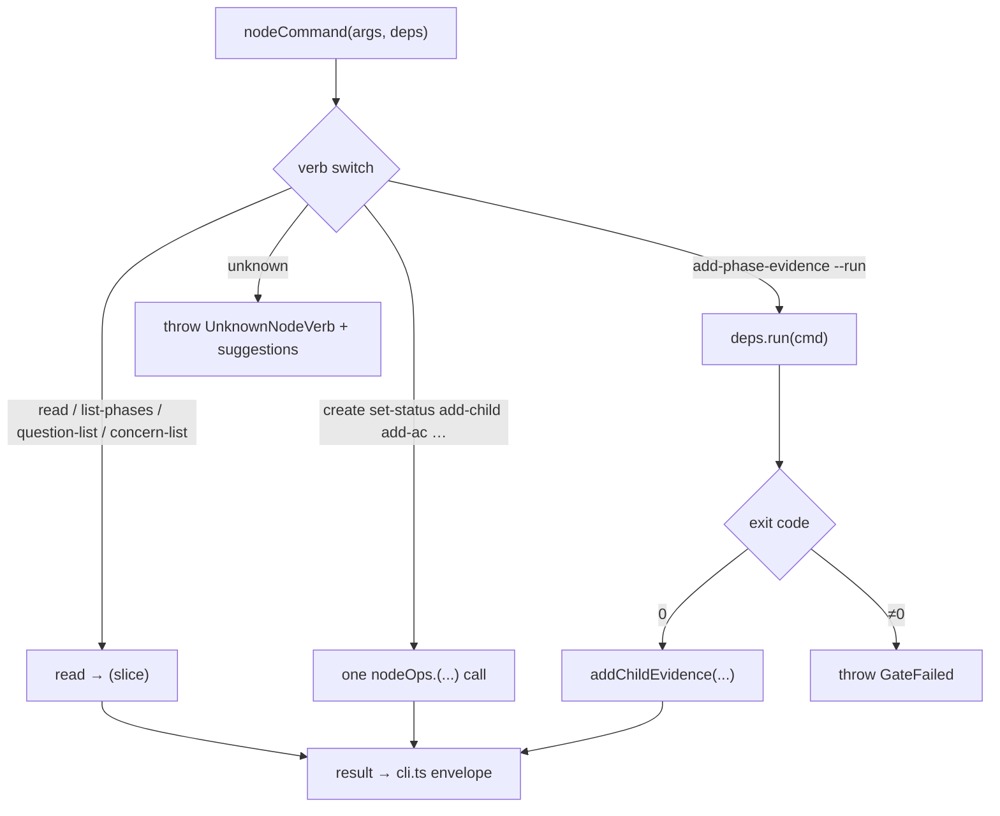

← [commands](../_commands.md)

# node

**BLUF:** one `nodeCommand(args, deps)` function holding a flat `switch` over ~30
generic, tier-generic node verbs that agents drive via Bash. Each verb maps to
**exactly one** `deps.nodeOps` facade call — no direct filesystem/parser access here,
and the hard invariant (no `done` without evidence) is **never re-checked** in the
CLI: a `nodeOps` error bubbles up and `cli.ts` renders it as an error envelope.

## Was

- **`args[0]` is the verb, the rest are positional.** A local `need(i, name)` guard
  throws `MissingArgument` for any absent required positional; unknown verb →
  `UnknownNodeVerb` with the full verb list as suggestions.
- **Read/inspect verbs** — `read`, plus convenience reads that `read` then slice:
  `list-phases` (→ `phases[]`), `question-list` (→ `questions[]`, optional
  `--status`/positional filter), `concern-list` (→ `concerns[]`, same filter).
- **Status/structure verbs** — `create`, `set-status`, `add-child`, `set-child-field`
  (value is `JSON.parse`d when it looks like JSON, else kept a string), `next-child`,
  `ready-children` (all runnable children — the epic fan-out batch), `set-child-status`,
  `add-phase`, `add-ac`, `set-ac-status`, `set-executor`, `set-phase-rules`,
  `set-field` (`context.*` fields get literal `\n` normalised to real newlines).
- **Question/concern threads** — `add-question`/`resolve-question` and
  `add-concern`/`resolve-concern` (both default `source: 'ai'`, optional `reasoning`).
- **Evidence + the deterministic gate** — `add-evidence`, `add-acceptance`,
  `set-acceptance-status`, and `add-phase-evidence` with its `--run "<cmd>"` mode:
  it **executes** the command via `deps.run`, captures exit code + output, and only
  writes evidence (flipping the AC done) on exit 0; non-zero throws a loud
  `GateFailed` — the evidence-honesty floor the agent cannot fake.
- **Re-do loop** — `set-failures` (writes failures + flips the AC back to pending),
  `clear-failures` (manual escape hatch; the redo done-flip clears them anyway).

## Wie

## Warum

Agents self-write through one uniform, greppable verb table over Bash (cli-only
transport). Each verb being a thin one-to-one facade call keeps the invariant in the
substrate where it can't be bypassed — the CLI is a pure conduit, not a second
guard.
