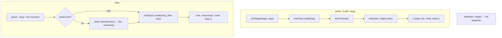

← [commands](../_commands.md)

# stage

**BLUF:** the four lifecycle stage verbs (`plan`/`refine`/`build`/`wrap`) plus the
read-only `steps` planner. Every stage verb returns an **orchestration plan** — the
node + the resolved, config-driven step list — for the in-session skill to execute.
The CLI does **not** spawn agents (a headless subprocess can't reach the session's
Task tool) and the engine-drives-AI path was removed entirely
(remove-headless-engine-path). `classify.ts` holds the pulled-out pure domain
helpers (slug + tier tripwire).

## Was

- **Three slug-only verbs share one helper.** `refine`/`build`/`wrap` all delegate to
  `runStage(stage, args, deps)`: read the node, derive its tier via `deps.tierFor`,
  resolve `deps.steps(tier, stage).steps`, return `{ stage, tier, node, steps }`.
  `build.ts` and `wrap.ts` are one-line wrappers over `refine.ts`'s `runStage`.
- **`plan` is the asymmetric one.** It parses an optional explicit tier
  (`TIER_KEYWORDS = {epic, task, phase}` — recognition only) and an optional
  `--slug`/`--slug=` override; with no tier it routes through the injected
  `deps.classify` seam (NOT a content heuristic in the CLI), then `create`s the node
  with the resolved tier and returns `{ tier, reasoning?, node, steps }` (the
  plan-stage steps).
- **`steps <tier> <stage>` is read-only.** It returns `deps.steps(tier, stage)` (the
  full `StepPlan`) — the orchestration menu; it never mutates and never spawns.
  Missing `tier`/`stage` → `MissingArgument`; unwired planner → `Unsupported`.
- **`classify.ts` lives OUTSIDE the transport.** `slugFromInput` (kebab-slug, sliced
  to 48 chars, leading/trailing dashes stripped, `'untitled'` fallback) and
  `classifyTier(phaseCount, independent?)` (the deterministic tripwire:
  `<5 → task`, `≥10 → epic`, `5–9 → independence test`) are pure functions — no deps,
  no effect, no state, no factory. Keeping them here leaves `plan.ts` as arg-parsing.

## Wie

## Warum

The skill is the orchestrator (it has the plugin + agents loaded); the CLI stays the
deterministic planner + ops. Splitting `classify`/`slug` out of `cli.ts`/`plan.ts`
keeps the transport layer pure JSON-envelope logic with the domain rules testable in
isolation.
