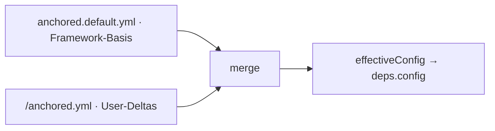

← [core](../_core.md)

# config

Lädt die **Base-Dependency** `config`: die effektive Konfiguration, die in alle
Factory-Functions injiziert wird. Einmal beim Bootstrap, dann unveränderlich.

| Unit | Verantwortung |
|---|---|
| [bootstrap](bootstrap.md) | `effectiveConfig = merge(default, user)`, validiert; baut `deps`. |
| merge | Deep-merge (User gewinnt) — in `bootstrap.md` mitbeschrieben. |
