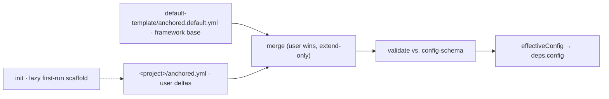

← [core](../_core.md)

# config

The **I/O-near loader layer**: it reads the shipped default template and the
project's `anchored.yml`, deep-merges them (user wins, extend-only) into the
single `effectiveConfig`, and injects it as the base dependency `deps.config`
into every factory — **once at startup, then immutable**.

config is deliberately **separate from [domain/config-schema](../domain/_domain.md)**:
config-schema *defines* the config shape (Zod), config *loads + merges* a concrete
instance against it. Loading vs. definition is one of the architecture's three
dividing lines.

| Area (link) | Responsibility (scope boundary) |
|---|---|
| [bootstrap](bootstrap.md) | `createBootstrap(deps).load(root)` → `effectiveConfig`: read default + user, validate each, merge. Also `defaultConfig()` (base side only). |
| [merge](merge.md) | Pure deep-merge `merge(default, user)`: scalars override, objects deep-merge, `steps` keyed extend-only, keyless lists union-append, `each` intrinsic. Depth-capped. |
| [init](init.md) | Lazy first-run scaffolding: writes a minimal `anchored.yml` + the `Bash(anchored *)` allowlist entry. Idempotent, over the `io` seam. |
