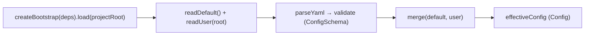

← [config](_config.md)

# bootstrap

Builds the effective config at startup. Reads the shipped default + the project's
`anchored.yml` through injected seams (no direct `node:fs` in the logic),
validates each, and merges them into the one `effectiveConfig`.

## What

- `effectiveConfig = merge(default-template/anchored.default.yml [base],
  <project>/anchored.yml [deltas])`, each side validated against
  [domain/config-schema](../domain/config-schema/_config-schema.md) (`ConfigSchema`).
- **Zero-config:** a missing OR empty/comments-only `anchored.yml` parses to
  `null` ⇒ treated as an **empty delta** (use all defaults), not an error.
- The default template is **not** copied into the user project — the base comes
  from the bundled `default-template/`. That is why the minimal user file suffices.
- The merge seam is **injectable** (`deps.merge`, defaults to [merge](merge.md)) —
  fakeable for wiring tests.
- `defaultConfig()` returns the validated base side alone (the default template,
  no user merge).

## How

`createBootstrap({ readDefault, readUser, parseYaml, merge? })` → `{ load(root),
defaultConfig() }`. Invalid YAML on either side throws
`anchoredError('ConfigError', …)`.

## Why

A single source of truth, loaded once: no scattered config reads, and the
factories get everything as a dep — testable with a fake config. Wired in
[bin.ts](../wiring.md).
