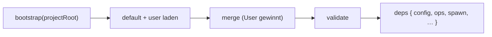

← [config](_config.md)

# bootstrap

Baut die effektive Config + die `deps` beim Start. `merge.ts` (deep-merge, User
gewinnt) ist der Helfer dahinter — hier mitbeschrieben, da trivial.

## Was

- `effectiveConfig = merge(anchored.default.yml [Basis], <project>/anchored.yml
  [Deltas])`, dann gegen [schema/config](../schema/config.md) validiert.
- Default-Template wird **nicht** ins User-Projekt kopiert — die Basis kommt aus
  dem mitgelieferten `default-template/`. Darum reicht die minimale User-Datei.
- Ergebnis-`deps` (`config`, `ops`, `spawn`, …) wird in `createEngine`/
  `createNodeOps` injiziert.

## Wie

## Warum

Eine Quelle der Wahrheit, einmal geladen: kein verstreutes Config-Lesen, und die
Factories bekommen alles als Dep — testbar mit einer Fake-Config.
