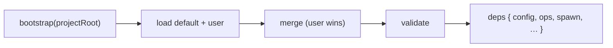

← [config](_config.md)

# bootstrap

Builds the effective config + the `deps` at startup. `merge.ts` (deep merge, user
wins) is the helper behind it — described here too, since it's trivial.

## What

- `effectiveConfig = merge(anchored.default.yml [base], <project>/anchored.yml
  [deltas])`, then validated against [schema/config](../schema/config.md).
- The default template is **not** copied into the user project — the base comes
  from the bundled `default-template/`. That's why the minimal user file suffices.
- The resulting `deps` (`config`, `ops`, `spawn`, …) are injected into
  `createEngine` / `createNodeOps`.

## How

## Why

A single source of truth, loaded once: no scattered config reads, and the
factories get everything as a dep — testable with a fake config.
