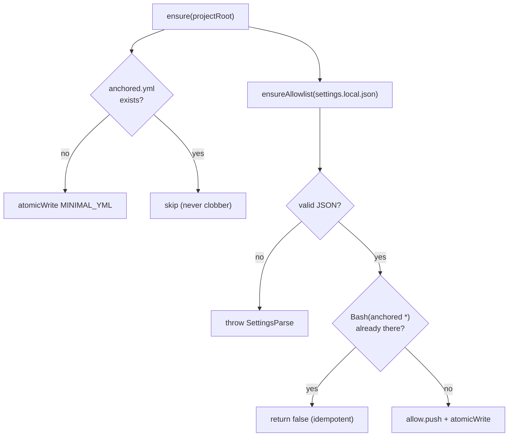

← [config](_config.md)

# init

The **lazy first-run scaffolding** — on the first `anchored` call in a project it
creates two things, both idempotent and via the injected `io` seam (no direct
`node:fs` in the logic, fakeable):

1. a **minimal `anchored.yml`** — schema directive + a pointer comment to the
   reference default, **not** a copy of the default config (defaults are immutable;
   a copy would drift).
2. the **`Bash(anchored *)` allowlist entry** in `.claude/settings.local.json` —
   so that all CLI calls (including background workflows) run without a permission prompt.

## What

- `createInit({ io }).ensure(projectRoot)` → `{ wroteYml, wroteAllowlist }`.
- **Never clobber:** an existing `anchored.yml` is not overwritten; the allow
  entry is never duplicated (merge into the existing `settings.local.json`,
  everything else is preserved).
- Invalid JSON in `settings.local.json` → `anchoredError('SettingsParse', …)`
  (no silent overwrite).

## How

`io` seam: `{ atomicWrite, readFile }`. `exists` is derived via a `readFile`
try/catch. Wired in [bin.ts](../wiring.md) (`createInit({ io }).ensure(root)`
**before** `createAnchored`).

## When

Effectively exactly once per project, triggered on the very first CLI call
([bin.ts](../wiring.md)) — idempotent a no-op thereafter. Mirrors the
[cli-only-transport](../cli/_cli.md) rule (lazy-init of the allowlist entry).
