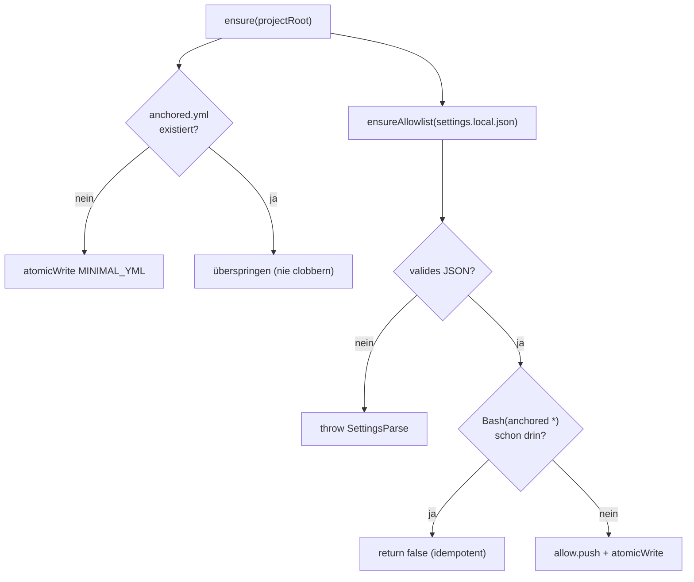

← [config](_config.md)

# init

Das **lazy First-Run-Scaffolding** — beim ersten `anchored`-Aufruf in einem Projekt
legt es zwei Dinge an, beide idempotent und über die injizierte `io`-Naht (kein
direktes `node:fs` in der Logik, fakebar):

1. eine **minimale `anchored.yml`** — Schema-Directive + ein Pointer-Kommentar auf
   die Referenz-Default, **kein** Copy der Default-Config (Defaults sind immutable;
   ein Copy würde driften).
2. den **`Bash(anchored *)`-Allowlist-Eintrag** in `.claude/settings.local.json` —
   damit alle CLI-Aufrufe (auch Hintergrund-Workflows) ohne Permission-Prompt laufen.

## Was

- `createInit({ io }).ensure(projectRoot)` → `{ wroteYml, wroteAllowlist }`.
- **Nie clobbern:** eine existierende `anchored.yml` wird nicht überschrieben; der
  Allow-Eintrag nie dupliziert (Merge in vorhandene `settings.local.json`, alles
  andere bleibt erhalten).
- Ungültiges JSON in `settings.local.json` → `anchoredError('SettingsParse', …)`
  (kein stilles Überschreiben).

## Wie

`io`-Naht: `{ atomicWrite, readFile }`. `exists` wird über einen `readFile`-try/catch
abgeleitet. In [bin.ts](../wiring.md) verdrahtet (`createInit({ io }).ensure(root)`
**vor** `createAnchored`).

## Wann

Genau einmal effektiv pro Projekt, getriggert beim allerersten CLI-Aufruf
([bin.ts](../wiring.md)) — danach idempotent ein No-op. Spiegelt die
[cli-only-transport](../cli/_cli.md)-Regel (lazy-init des Allowlist-Eintrags).
