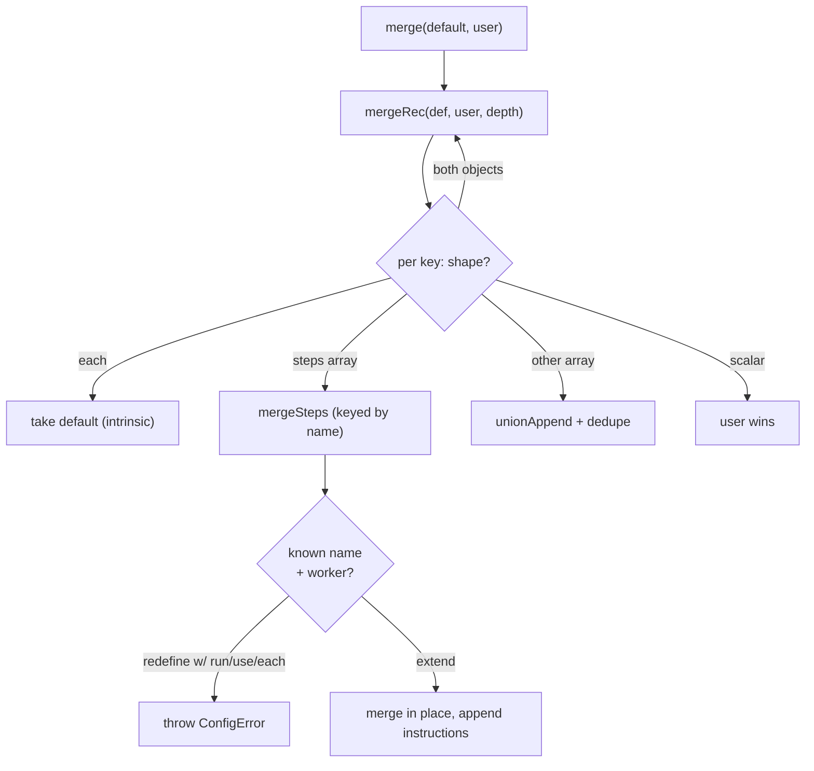

← [config](_config.md)

# merge

The pure, stateless deep-merge behind [bootstrap](bootstrap.md):
`merge(defaultCfg, userCfg) → effectiveConfig`. **Extend-only** — the framework
defaults are the floor; the user delta layers on top, it never strips a built-in.

## What

Merge semantics are decided **by shape, per key**:

- **scalars** → user wins (override).
- **objects** → deep-merge by key (recursive).
- **`steps` lists** → **keyed by `name`, extend-only**: a known name merges in
  place (position kept, `instructions` append); a new name inserts by
  `before`/`after` (else appended). No remove op — a built-in step can never drop.
- **keyless value lists** (`stop`, `rules`) → union-append + dedupe (never replace).
- **`each`** → **intrinsic**: always taken from the default, never from the user.
- **depth-cap** → nesting deeper than 64 levels throws `ConfigError` (hostile/malformed
  guard — real configs are ~5 levels).

A **built-in worker** (a bare default step with no `run`/`use`/`each`) may only be
**extended** (`instructions`/`involve`); redefining it with `run`/`use`/`each`
throws `ConfigError` — otherwise arbitrary shell could hijack a privileged slot
like `implement`.

## How

`merge(defaultCfg: Config, userCfg: Config): Config` — no state, no effects (the
factory-functions rule permits pure helpers).

## Why

Extend-only is the substrate guarantee that **no privileged built-in can be
silently dropped or hijacked** by a user delta — the user adds and tunes, the
framework floor stays intact.
