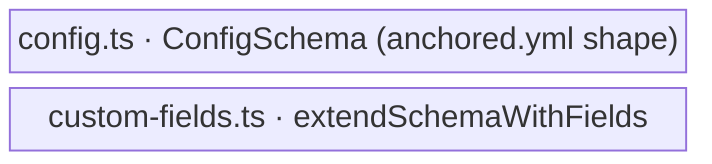

← [domain](../_domain.md)

# config-schema

The **definition** of the `anchored.yml` shape (Zod) — the fractal tier/stage
blocks, plus the helper that threads config-declared custom fields into a tier's
node schema. Definition only; the merge/load **wiring** lives in `config/`
(deliberately separate — definition vs. wiring).

| Area | Responsibility (scope boundary) |
|---|---|
| [config-schema](config-schema.md) | Everything that *defines and threads the config shape* — `ConfigSchema` (tier blocks, stage shapes, `build` extras) and `extendSchemaWithFields` (declared custom fields → strict tier schema). |
