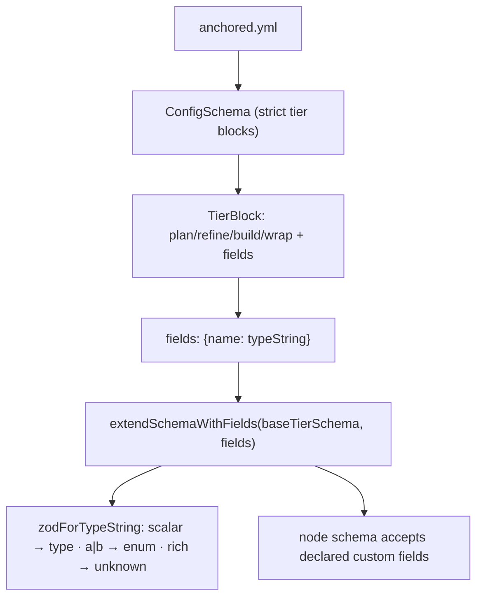

← [config-schema](_config-schema.md)

# config-schema

The Zod definition of `anchored.yml` (`config.ts`) and the custom-field threading
helper (`custom-fields.ts`). The schema is fractal: top-level tier blocks, each
with the four stages; only `build` carries the loop edge + bounds. This is the
*shape definition* — the loader that merges default + user lives in `config/`.

## Was — `ConfigSchema`

- **Top-level** (`z.strictObject`): `phase`, `task`, `epic`, `project` tier
  blocks (all optional) + `_lib` (the YAML-anchor alias bucket). `.strict`
  rejects any other top-level key.
- **`TierBlock`**: `plan` / `refine` / `wrap` (each a `{ steps? }` `Stage`),
  `build` (a `BuildStage`), and `fields`.
- **`BuildStage`**: `steps?`, plus the fractal extras — `each?` (`TierName`),
  `stop?: string[]`, `retry_limit?` (int, **1–20**, upper-bounded so a config
  can't request a runaway loop), and `mode?` (`sequential | workflow`).
- **`FieldsBlock`** = `z.record(string, unknown)` — the per-tier data-model
  shape (policy). Values are descriptive type-strings (e.g. `"pending | done"`),
  so the block stays loose; the schema knows **no** concrete step names.
- Helpers: `parseConfig` (throws) and `safeParseConfig` (`SafeResult<Config>`).

## Was — `extendSchemaWithFields`

- The base tier schemas are **strict** (reject unknown keys) — correct for the
  mechanism, but it blocked a *declared* custom field from being `set-field`-ed.
- **`extendSchemaWithFields(base, fields)`** extends `base` with exactly the
  declared `fields` not already in the base shape, so a declared custom field
  validates on read+write while every known field keeps its strict typed check.
  Returns `base` unchanged when there is nothing custom to add.
- **`zodForTypeString`** maps the descriptive type-string to a check:
  simple scalars (`string`/`markdown`/`kebab`/`date`/`number`/`int`/`boolean`)
  → the matching zod type; a pipe-union of `≥2` literal tokens (`a | b | c`) →
  `z.enum`; anything richer (`list<…>`, `view<…>`) → permissive `unknown`.

## Wie

```ts
const ConfigSchema = z.strictObject({ phase?, task?, epic?, project?, _lib? })
function parseConfig(input: unknown): Config
function safeParseConfig(input: unknown): SafeResult<Config>

function extendSchemaWithFields(
  base: z.ZodObject,
  fields: Record<string, unknown> | undefined,
): z.ZodObject
```



## Warum

Splitting the schema *definition* (here) from the merge/load *wiring*
(`config/`) keeps the definition layer effect-free. The `retry_limit` bound and
the strict top-level are mechanism (guarantees); the loose `fields` block and the
custom-field threading are what let the policy layer add data shape without
weakening the strict typed check on known fields.
