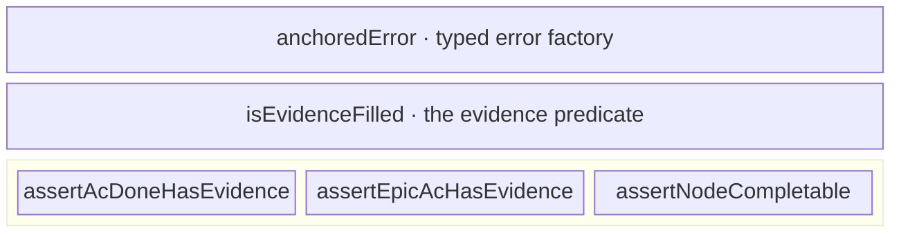

← [domain](../_domain.md)

# invariants

The hard substrate invariant — **no `ac → status:done` without `evidence`** —
plus the typed-error factory. Pure predicates + throwing asserts, no hidden
effects, no classes.

| Area | Responsibility (scope boundary) |
|---|---|
| [invariants](invariants.md) | Everything that *guards evidence-honesty in the data model* — the evidence predicate, the three asserts (AC / epic-item / node-completable), and the `anchoredError` factory they throw. |
