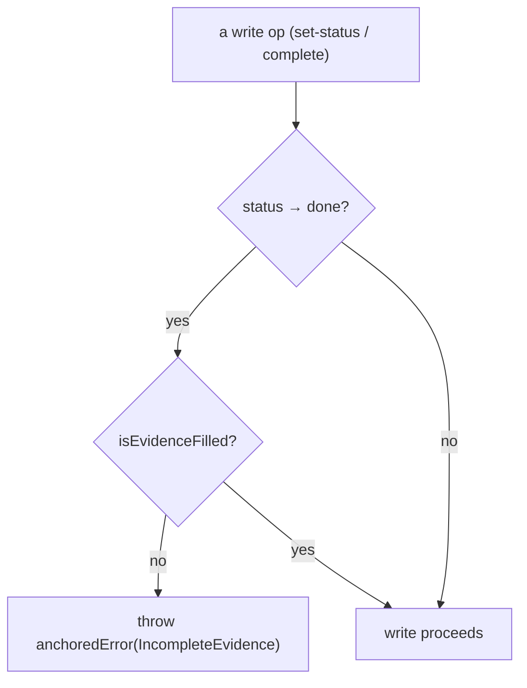

← [invariants](_invariants.md)

# invariants

The hard substrate invariant: an acceptance criterion may only reach
`status:done` when it carries real `evidence`. Enforced at the **data model** —
never in a (skippable) step — as pure predicates and throwing asserts.

## Was

- **`isEvidenceFilled(evidence)`** — the predicate: `true` only if `evidence` is
  an array containing at least one non-empty, non-sentinel string (a value that
  trims to `''` or `'—'` does not count).
- **`anchoredError(kind, message, suggestions?)`** — the typed-error factory (no
  class, per the factory-functions rule): sets `name`/`kind` and optional
  `suggestions`. The shared error type for the whole substrate (also thrown by
  [transitions](../lifecycle/transitions.md)).
- **`assertAcDoneHasEvidence(ac)`** — throws `IncompleteEvidence` if a single AC
  is `done` without filled evidence.
- **`assertEpicAcHasEvidence(id, status, merged)`** — the epic-tier sibling:
  throws `AcceptanceNoEvidence` if an epic DoD item flips `done` with an empty
  *merged* (existing + newly-passed) evidence set.
- **`assertNodeCompletable(node)`** — throws `IncompleteEvidence` listing every
  `acceptance_criteria` entry that lacks evidence (the whole-node gate).

## Wie

```ts
function isEvidenceFilled(evidence: unknown): boolean
function anchoredError(kind: string, message: string, suggestions?: string[]): AnchoredError
function assertAcDoneHasEvidence(ac: AcLike): void
function assertEpicAcHasEvidence(id: string, status: string, merged: string[] | undefined): void
function assertNodeCompletable(node: NodeLike): void
```



## Warum

This is the core value of anchored: "everything is configurable" holds **without**
losing integrity. If the evidence check lived in a step it could be reordered,
overridden, or dropped from the config — and a hallucinated "done" would slip
through. Living at the writing op (the data-model boundary) makes it a
guarantee that no policy can bypass — **mechanism, not policy**. The phase
`AcceptanceCriterion` schema mirrors `isEvidenceFilled` as a `.refine` (a second
line of defence at parse time).
