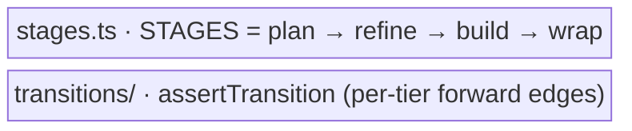

← [domain](../_domain.md)

# lifecycle

The lifecycle layer: the canonical four **stages** every tier walks, and the
per-tier **forward-only state machine** that says which status moves are legal.

| Area | Responsibility (scope boundary) |
|---|---|
| [stages](stages.md) | Everything that *names the stage sequence once* — the `STAGES` tuple and the `Stage` type. |
| [transitions](transitions.md) | Everything that *guards a status change* — the per-tier transition table and the tier-generic `assertTransition`. |
