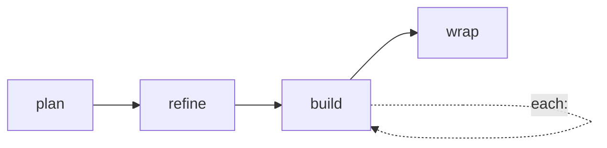

← [lifecycle](_lifecycle.md)

# stages

The four lifecycle stages, defined exactly once. Every tier walks
`plan → refine → build → wrap`; `build.each` is the fractal recursion and the
`phase` tier is the leaf.

## Was

- **`STAGES = ['plan', 'refine', 'build', 'wrap'] as const`** — the single home
  for the stage sequence (formerly a literal duplicated across `ops/validate` and
  elsewhere).
- **`Stage`** is the union type `(typeof STAGES)[number]` — `'plan' | 'refine' |
  'build' | 'wrap'`.
- The stages are *stage names*, distinct from a tier's *status enum* (which has
  extra terminal/branch states like `drafted`/`done`); see
  [transitions](transitions.md).

## Wie

```ts
export const STAGES = ['plan', 'refine', 'build', 'wrap'] as const
export type Stage = (typeof STAGES)[number]
```


