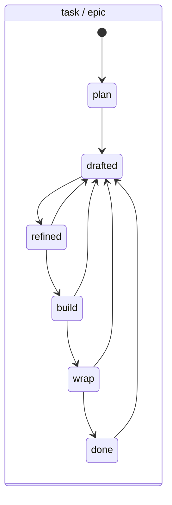
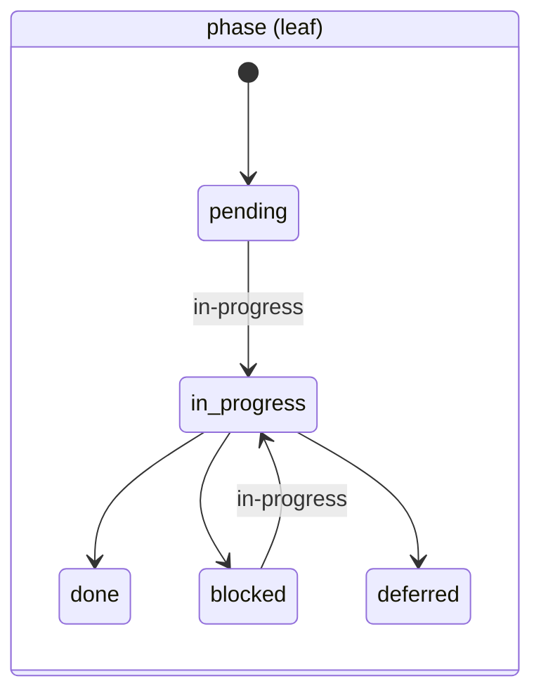

← [lifecycle](_lifecycle.md)

# transitions

The per-tier, **forward-only** state machine. One tier-generic `assertTransition`
parametrised over the tier descriptor — no per-tier duplicate functions.

> Source: `lifecycle/transitions/transitions.ts`.

## Was

- **`TRANSITIONS`** maps `tier → from-status → allowed[]`. Only forward edges are
  allowed; the single backward edge is task/epic **update-mode re-entry** to
  `drafted` (from `refined`/`build`/`wrap`/`done`).
- **`assertTransition(descriptor, from, to)`** — no-op when `from === to`
  (idempotent self-transition); otherwise looks up the allowed set for the
  descriptor's tier and throws an `InvalidTransition` `anchoredError` (with the
  allowed targets as suggestions) if `to` isn't permitted. A terminal state
  suggests `(terminal state — no further transitions)`.
- **`project`** stays on the reduced reserved enum (`planning → building →
  done`), out of scope until exercised.
- Epic mirrors task's edges exactly (decision D1).

## Wie

```ts
interface TierLike { tier: string }
function assertTransition(descriptor: TierLike, from: string, to: string): void
```





The `done`/`deferred` phase states are terminal (empty allowed set);
`project` runs `planning → building → done`.

## Warum

Forward-only edges make the lifecycle a deterministic, auditable mechanism: a
status can never silently regress, and the one sanctioned backward edge
(`→ drafted`) is the explicit update-mode re-entry. Encoding the table in code
(not config) is mechanism — the legal moves are a guarantee, not a policy the
user reconfigures.
