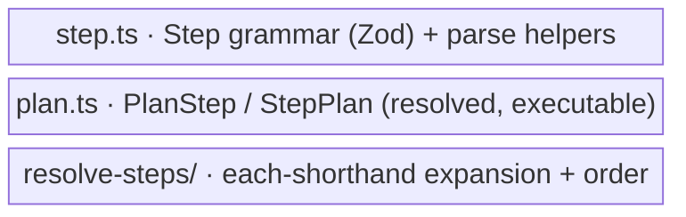

← [domain](../_domain.md)

# steps

The step layer: the **grammar** of a step (Zod), the **resolved-plan** types the
orchestration consults, and **resolve-steps** — the normalisation that expands
the `each`-shorthand and applies the implicit loop body.

| Area | Responsibility (scope boundary) |
|---|---|
| [step](step.md) | Everything that *defines a step's structural shape* — the `Step` interface, `StepSchema` with its XOR refinements, and parse helpers. |
| [plan](plan.md) | Everything that *types the resolved, executable plan* — `PlanStep` (worker/run/loop entry) and `StepPlan` (tier/stage plan). |
| [resolve-steps](resolve-steps.md) | Everything that *normalises a stage's steps* — `each`-shorthand → loop step, implicit `[run]` body, tier/stage lookup over the merged config. |
