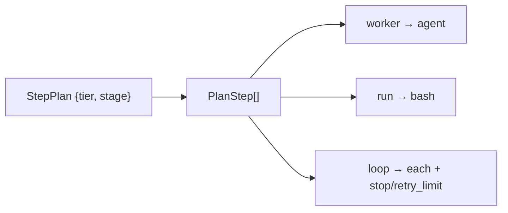

← [steps](_steps.md)

# plan — resolved plan types

The resolved, **executable** step-plan types — the orchestration menu the skills
consult. Pure domain types (the step grammar's executable shape), kept in the
step domain so the store/validate surface and the orchestration planner can
reference them without reaching up into `cli/`.

## Was

- **`PlanStep`** is one resolved entry, discriminated by `kind`:
  - `kind: 'worker'` → `agent` names the plugin agent to spawn
    (e.g. `build-implement`).
  - `kind: 'run'` → `run` is the bash command.
  - `kind: 'loop'` → `each` is the child tier to iterate (carries optional
    `stop`/`retry_limit`).
  - `instructions` is uniform prose guidance for the skill across all kinds.
- **`StepPlan`** is the full plan for one tier/stage: `{ tier, stage, steps:
  PlanStep[] }`.
- These are the **output** shape (vs. the `Step` *grammar* in
  [step](step.md), which is the parsed-config input shape).

## Wie

```ts
interface PlanStep {
  name: string
  kind: 'worker' | 'run' | 'loop'
  agent?: string         // worker
  run?: string           // run
  instructions?: string  // uniform skill guidance
  each?: string          // loop: child tier
  stop?: string[]
  retry_limit?: number
}
interface StepPlan { tier: string; stage: string; steps: PlanStep[] }
```


