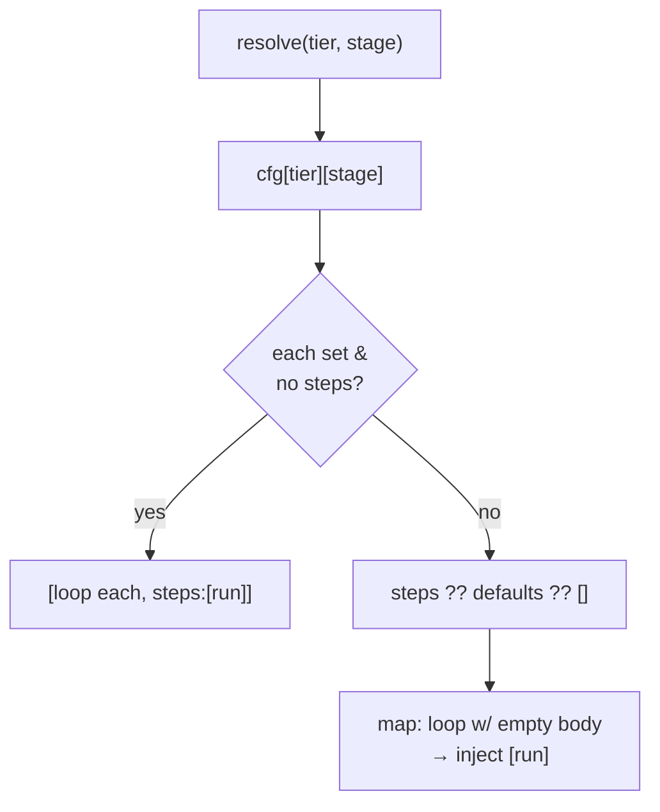

← [steps](_steps.md)

# resolve-steps

Normalises a stage's configured steps into the effective, ordered sequence:
expands the `build: { each: <tier> }` shorthand into a positioned loop step, and
gives any loop step without an explicit body the implicit `[run]` body. Pure +
deterministic, no hardcoded domain step *names* (`loop`/`run` are structural
built-ins).

> Source: `steps/resolve-steps/resolve-steps.ts`.

## Was

- **`resolveSteps(stageCfg, opts?)`** — the core normaliser:
  - `{ each: t }` with no `steps` → `[{ name:'loop', each:t, steps:[{name:'run'}] }]`
    (the shorthand expansion, Item 5a).
  - otherwise takes `cfg.steps` (or `opts.defaults`, or `[]`), and maps each step
    so a loop step with an empty/absent body gets the implicit `[{name:'run'}]`
    body.
- **`createResolveSteps(cfg)`** — a factory over the merged `effectiveConfig`,
  returning `{ resolve(tier, stage) }` that looks up `cfg[tier][stage]` and runs
  `resolveSteps` on it.
- **Defaults are merged in upstream** by `config/merge`; resolve-steps only
  normalises the `each`-shorthand + order. The canonical built-in sequences
  (e.g. `task/plan` → `discover, rules-scan, decompose`; `phase/build` →
  `implement, …, task-validate, code-validate`) come from the merged default
  template, not from this file.

## Wie

```ts
function resolveSteps(stageCfg: StageCfg | undefined, opts?: { defaults?: Step[] }): Step[]
function createResolveSteps(cfg: Record<string, unknown>): {
  resolve(tier: string, stage: string): Step[]
}
```



## Warum

The engine dispatches config-driven and knows no concrete step names; the
opinionated sequences live in the default template, merged in before resolution.
This keeps resolve-steps a pure shape-normaliser (the *mechanism* of "expand the
shorthand, fix the order") while the *policy* (which steps, in what canonical
order) stays in config.
