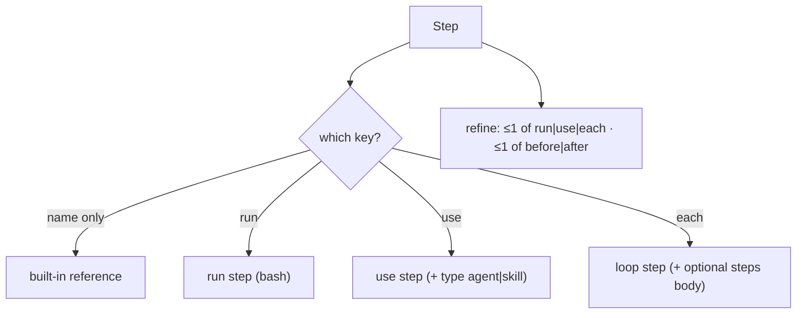

← [steps](_steps.md)

# step — the grammar

The structural grammar of a step (Zod). Pure data schemas + parse helpers, no
module-level side effects (the allowed "pure data / Zod" exception of the
factory-functions rule). Reserved built-in step *names* are policy and live in
[resolve-steps](resolve-steps.md) — this file is **only** the shape.

## Was

- A **`Step`** is one of: a bare built-in reference (`name` only), a **run** step
  (`run`), a **use** step (`use`, optionally `type: agent|skill`), or a **loop**
  step (`each` + optional `steps` body).
- `StepSchema` is a `z.lazy` recursive `z.strictObject` (the `steps` body nests
  `Step`), guarded by five refinements (below).
- **`TierName`** = `phase | task | epic | project`; **`StepType`** =
  `agent | skill`; **`InvolveLevel`** = `all | high-only | none`.
- Helpers: **`parseStep`** (throws), **`safeParseStep`** / **`safeParseWith`**
  (returns a `SafeResult<T>` tagged union — `{ok:true,value}` | `{ok:false,error}`).

### Refinements (the rules a valid step obeys)

- **XOR**: at most one of `run | use | each` (a bare `name` is a built-in
  reference).
- `type` is valid **only** on a `use`-step.
- `involve` is valid **only** on the `walk` step.
- a `steps` body is valid **only** on a loop step (`each`).
- a step sets **at most one** of `before | after` (the positioning hint).

## Wie

```ts
interface Step {
  name: string
  run?: string; use?: string
  type?: 'agent' | 'skill'
  instructions?: string
  involve?: 'all' | 'high-only' | 'none'
  before?: string; after?: string
  each?: TierName
  steps?: Step[]
}
function parseStep(input: unknown): Step
function safeParseStep(input: unknown): SafeResult<Step>
```


