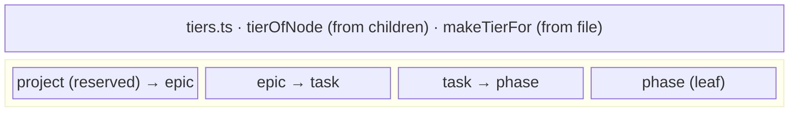

← [domain](../_domain.md)

# tiers

The tier layer: the four **tier descriptors** (project/epic/task/phase) — each a
status enum, a child-tier pointer, and a Zod node schema — plus the two
**derivations** that answer "which tier is this node". One fractal form; `phase`
is the leaf, `project` is reserved.

| Area | Responsibility (scope boundary) |
|---|---|
| [tiers](tiers.md) | Everything that *derives a node's tier* — `tierOfNode` (sync, from an in-memory child collection) and `makeTierFor` (async, reads the persisted file, also detects `phase`). |
| [descriptors](tiers.descriptors.md) | Everything that *defines each tier's node shape* — the per-tier status enums, child-tier pointers, and full Zod field lists for project/epic/task/phase. |
