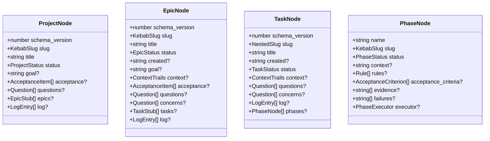

← [tiers](_tiers.md)

# tiers — descriptors (field reference)

The four tier descriptors. Each is `{ tier, statusEnum, childTier, schema }` —
the mechanics half (status enum, child pointer) fixed in code, the Zod node
schema defining the persisted shape. All schemas are `z.strictObject` (an unknown
key is rejected — custom fields are threaded in separately, see
[config-schema](../config-schema/_config-schema.md)).

## Was

- **Fractal form**: every descriptor has the same four keys; `childTier` chains
  `project → epic → task → phase`, with `phase.childTier = undefined` (the leaf).
- **`project` is reserved** — same form, not exercised by any active code path
  yet; kept so the schema accepts the shape.
- **Epic mirrors task exactly** — same six status values, same edges (decision
  D1), so the skills run uniform stage-transitions on every tier with no
  tier-branching.
- **Two evidence floors** — a phase `AcceptanceCriterion` and an epic acceptance
  item both `.refine` that `status:'done'` requires non-empty evidence (the
  schema-level second line of defence behind
  [invariants](../invariants/_invariants.md)).

## Wie — status enums + child pointers

| Tier | `statusEnum` | `childTier` |
|---|---|---|
| project (reserved) | `planning · building · done` | `epic` |
| epic | `plan · drafted · refined · build · wrap · done` | `task` |
| task | `plan · drafted · refined · build · wrap · done` | `phase` |
| phase (leaf) | `pending · in-progress · done · blocked · deferred` | `undefined` |

### Shared shapes

- **`KebabSlug`** — `^[a-z0-9]+(-[a-z0-9]+)*$`. **`NestedSlug`** (task only) — a
  kebab slug, optionally nested as `<epic>/<slug>`.
- **`ContextTrails`** — `{ plan?, refine?, build?, wrap? }` prose, one entry per
  stage (epic + task carry it).
- **`Question`** — `{ id, text, priority(low|medium|high), origin?,
  status(open|resolved), answer?, source(user|ai)?, reasoning?, phase? }`. The
  `concerns` array on epic/task reuses the same shape ("check at the end"
  threads; `done` blocks while one is open).
- **`LogEntry`** — `{ at, kind, note }`.
- **`AcceptanceItem`** (epic/project DoD) — `{ id, text, status(pending|done) }`;
  the **epic** variant adds `evidence?: string[]` (delivery provenance).
- **`AcceptanceCriterion`** (phase + epic `TaskStub`) — `{ id, text,
  status(pending|done), evidence?: string[], failures?: string[] }`, refined so
  `done` requires non-empty evidence.
- **`TaskStub`** (epic child queue) — `{ slug, goal?, status(stubStatus),
  depends_on?, acceptance_criteria? }`. **`EpicStub`** (project) — `{ slug, goal,
  status(stubStatus), depends_on? }`.
- **`stubStatusValues`** — `pending · active · done · blocked` (the parent's
  loop-queue marker, **not** the child's own lifecycle; `active`, never the phase
  word `in-progress`).
- **`Rule`** (phase) — `{ path, why }`. **`PhaseExecutor`** — `implement |
  workflow` (reserved, workflow-mode; no injected default — a phase without it
  round-trips byte-identical).

## Warum

The descriptors split *mechanics* (status enum + child pointer = code, fixed)
from *fields* the user can extend, and the strict objects make a typo a hard
failure rather than a silently-persisted key. The duplication between epic and
task is deliberate (D1): identical lifecycles mean the orchestration never
branches on tier.
