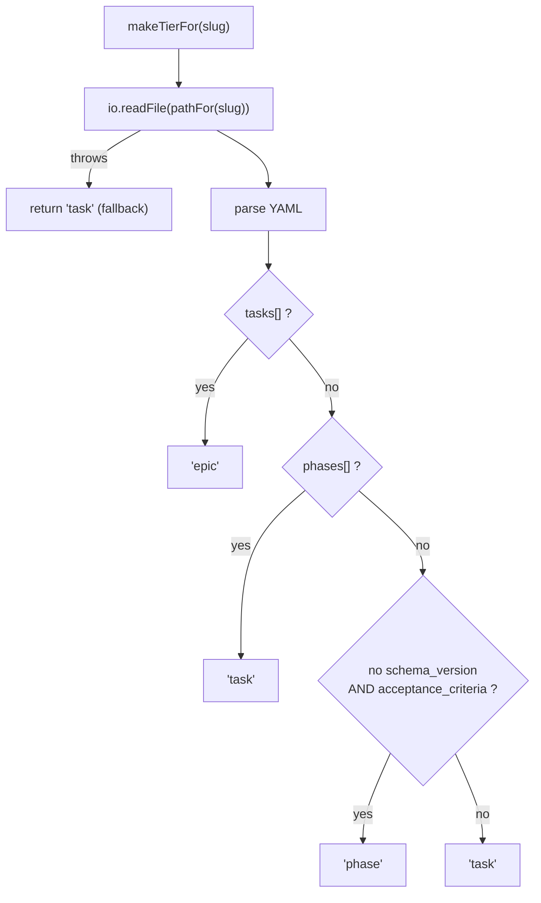

← [tiers](_tiers.md)

# tiers — tier derivation

Two pure functions that answer "which tier is this node", united into one file
from their two former homes. Both inspect the same structural markers
(`tasks[]` → epic, `phases[]` → task); they differ only in *where* they read the
node from.

## Was

- **`tierOfNode(node)`** derives the tier from an **in-memory child collection**
  (sync): an `Array.isArray(node.tasks)` → `'epic'`, an
  `Array.isArray(node.phases)` → `'task'`; otherwise `'task'`. It does **not**
  detect `phase` (a phase has no child collection to inspect).
- **`makeTierFor(io, pathFor)`** returns an **async** `(slug) => Promise<string>`
  that reads the **persisted file** (the SSOT) and parses its YAML:
  `tasks[]` → `'epic'`, `phases[]` → `'task'`,
  a node with **no `schema_version`** but **with `acceptance_criteria`** →
  `'phase'`, else `'task'`. A missing/unreadable file (a fresh create) falls back
  to `'task'`.
- It lives **behind the `io` seam** (it `await`s the read) so the wiring root
  (`index.ts`) stays a pure, await-free factory. `tierOfNode` is re-exported on
  the public surface; `makeTierFor` is wired into the slug-facade.
- No slug-default guessing — the markers in the content decide, nothing else.

## Wie

```ts
function tierOfNode(node: unknown): string
function makeTierFor(
  io: { readFile(path: string): Promise<string> },
  pathFor: (slug: string) => string,
): (slug: string) => Promise<string>
```



## Warum

The split exists because the two callers have different inputs: a caller that
already holds the parsed node in memory needs no I/O (`tierOfNode`), while a
caller that has only a slug must read the file — and only the file path can see
a leaf `phase` (its lack of `schema_version` + presence of `acceptance_criteria`
is the discriminator). Both export names are preserved verbatim from before the
unification.
