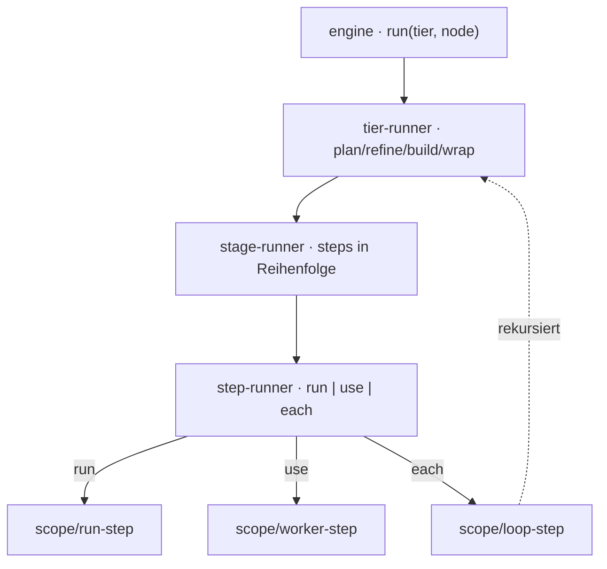

← [core](../_core.md)

# engine

Die **fraktale Factory-Engine** — der deterministische Kern, der einen Knoten
durch `plan → refine → build → wrap` fährt. Jede Ebene ist eine Factory
`createX(cfg, deps) → { run(input) → output }`; der `loop`-Step schließt die
Rekursion (ruft den `tier-runner` der Kind-Etage). AI ist nur ein Effekt hinter
`deps.spawn`.

| Unit | Verantwortung |
|---|---|
| [engine](engine.md) | Top-Level-Orchestrator: `createEngine(deps) → run(tier, node)`. |
| [tier-runner](tier-runner.md) | Fährt die vier Stages eines Knotens. Eine Funktion für alle Tiers. |
| [stage-runner](stage-runner.md) | Fährt die `steps` einer Stage in Deklarations-Reihenfolge; hält bei Fehler. |
| [step-runner](step-runner.md) | Dispatch eines Steps: `run` → Bash, `use` → Worker, `each` → Loop. |
| scope/ | Helfer: [run-step](scope/run-step.md), [worker-step](scope/worker-step.md), [loop-step](scope/loop-step.md), [loop-workflow](scope/loop-workflow.md), [worker-dispatch](scope/worker-dispatch.md), [resolve-steps](scope/resolve-steps.md). |
