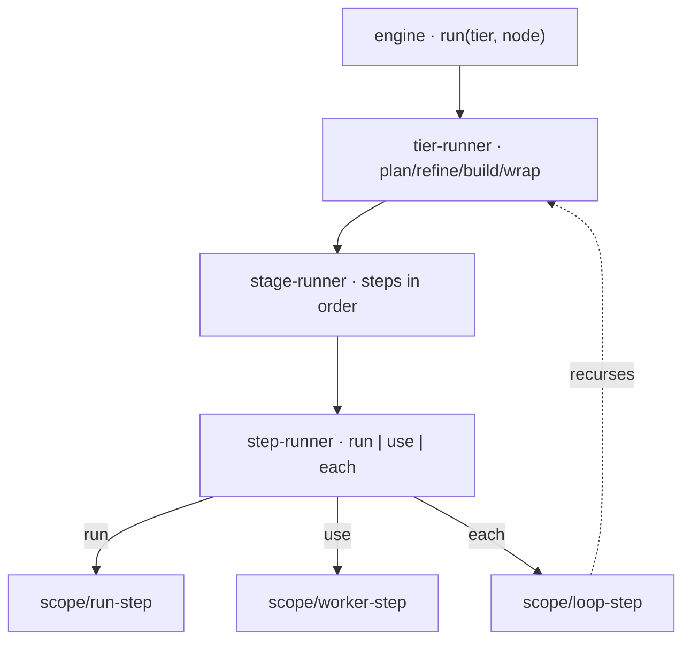

← [core](../_core.md)

# engine

The **fractal factory engine** — the deterministic core that drives a node
through `plan → refine → build → wrap`. Each layer is a factory
`createX(cfg, deps) → { run(input) → output }`; the `loop` step closes the
recursion (calling the `tier-runner` of the child tier). AI is only an effect
behind `deps.spawn`.

| Unit | Responsibility |
|---|---|
| [engine](engine.md) | Top-level orchestrator: `createEngine(deps) → run(tier, node)`. |
| [tier-runner](tier-runner.md) | Drives the four stages of a node. One function for all tiers. |
| [stage-runner](stage-runner.md) | Drives a stage's `steps` in declaration order; stops on error. |
| [step-runner](step-runner.md) | Dispatch of a step: `run` → Bash, `use` → Worker, `each` → Loop. |
| scope/ | Helpers: [run-step](scope/run-step.md), [worker-step](scope/worker-step.md), [loop-step](scope/loop-step.md), [loop-workflow](scope/loop-workflow.md), [worker-dispatch](scope/worker-dispatch.md), [resolve-steps](scope/resolve-steps.md). |
