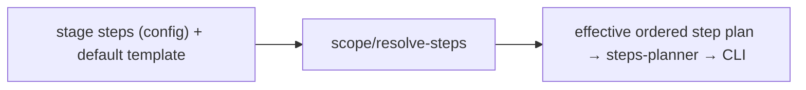

← [core](../_core.md)

# engine

The **step-resolution logic** the [steps-planner](../ops/_ops.md) consumes. After
the headless engine-run chain was removed (a headless `claude -p` subprocess can
not reach the session's Task tool), the in-session skill is the orchestrator: it
drives `plan → refine → build → wrap` through `anchored <stage>` + `anchored node`.
What survives here is the pure, deterministic config logic that turns a stage's
declared `steps` into the canonical, ordered effective step plan the skill walks.

| Unit | Responsibility |
|---|---|
| scope/ | [resolve-steps](scope/resolve-steps.md) — inserts the built-in defaults, enforces their canonical order, merges `instructions`. The only piece of the old engine folder that outlived the headless run chain. |

> The former orchestrator (`engine.run`), the tier/stage/step runners, the
> `loop`/`worker-step` recursion, and the `spawn` effect were removed with the
> headless path. The orchestration now lives in the in-session skill; the CLI
> stage verbs only hand it the resolved plan (see [cli/commands](../cli/commands.md)).
