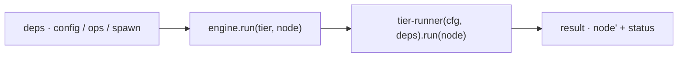

← [engine](_engine.md)

# engine

Der Top-Level-Orchestrator. `createEngine(deps)` gibt ein `{ run(tier, node) }`
zurück; `run` startet den `tier-runner` für den übergebenen Knoten. Reiner,
deterministischer Code — die einzige Verbindung zur AI ist `deps.spawn`.

## Was

- `createEngine(deps) → { run(tier, node) }`. `deps` ist die beim Bootstrap
  gebaute Base-Dependency (`config`, `ops`, `spawn`, …).
- `run(tier, node)` wählt den Tier-Schema-Deskriptor und fährt den
  `tier-runner` über den Knoten; Rückgabe = der aktualisierte Knoten + Status.
- Kennt **kein** AI-Detail: Worker-Effekte laufen ausschließlich über
  `deps.spawn`, das hier nur durchgereicht wird.

## Wie

`createEngine(deps): { run(tier: TierName, node: Node) => Promise<Result> }`

## Warum

Eine einzige Naht für die gesamte Ausführung. Weil alle Effekte (Dateizugriff
über `ops`, AI über `spawn`) injizierte Deps sind, ist die Engine im Test mit
Fakes fahrbar — ohne echtes Claude, ohne echtes Dateisystem.
