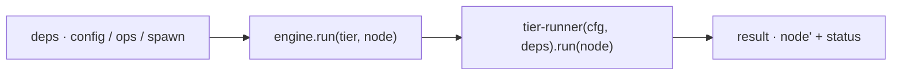

← [engine](_engine.md)

# engine

The top-level orchestrator. `createEngine(deps)` returns a `{ run(tier, node) }`;
`run` starts the `tier-runner` for the passed node. Pure,
deterministic code — the only connection to the AI is `deps.spawn`.

## What

- `createEngine(deps) → { run(tier, node) }`. `deps` is the base dependency
  built at bootstrap (`config`, `ops`, `spawn`, …).
- `run(tier, node)` selects the tier schema descriptor and drives the
  `tier-runner` over the node; return value = the updated node + status.
- Knows **no** AI detail: worker effects run exclusively through
  `deps.spawn`, which is only passed through here.

## How

`createEngine(deps): { run(tier: TierName, node: Node) => Promise<Result> }`

## Why

A single seam for the entire execution. Because all effects (file access
via `ops`, AI via `spawn`) are injected deps, the engine is runnable in tests with
fakes — without real Claude, without a real file system.
