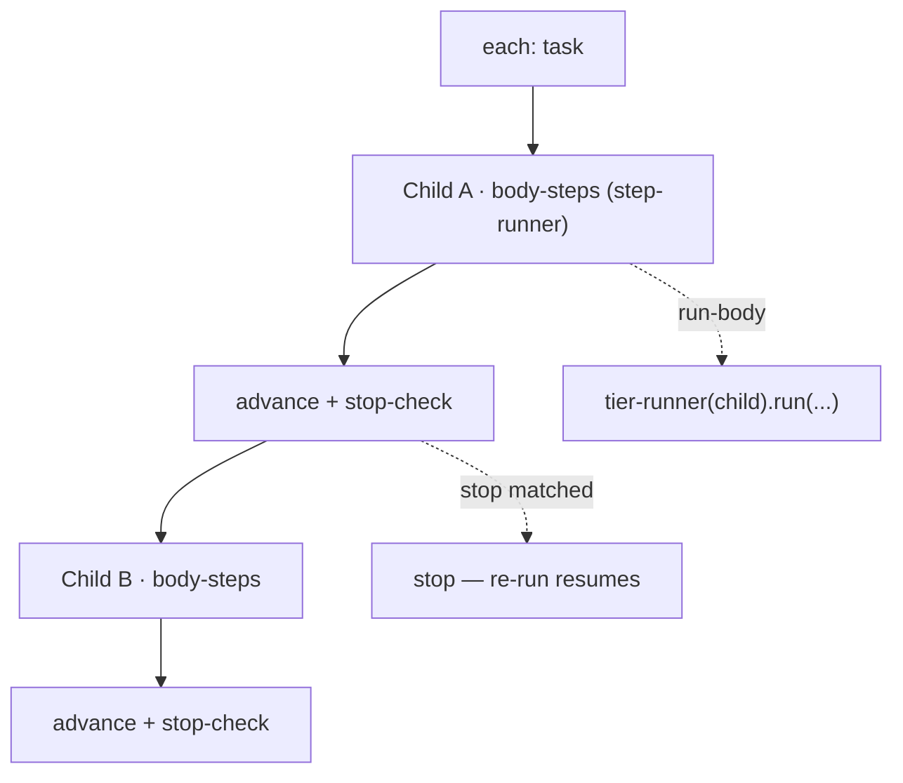

← [engine](../_engine.md)

# loop-step

Helper for a step with `each: <tier>` — iterates over the children of a
node and runs the **child lifecycle** per child. This is where the fractal
recursion closes (it calls the [tier-runner](../tier-runner.md) of the child tier).

## What

- Input: a step with `each: <child-tier>` and an optional `steps` **body**.
- **Interleaved**: per child the whole body runs in order, *then* the
  next child (A→body, B→body, …) — not step-1 over all children first.
- The body default is `[run]` = run the child lifecycle; the body runs over
  the same [step-runner](../step-runner.md) (fractal, one layer deeper).
- After each child: advance status + `stop` check — built-in, no user step.
- Child order follows the dependency graph ([children](../../ops/scope/children.md)): the first
  `pending` whose `depends_on` are all `done`. First block → stop (v1
  sequential).

## How

`each: <tier>` (shorthand) ≙ `{ name: loop, each: <tier>, steps: [run] }`.

## Why

The per-child mechanics (spawning, advancing, stop) belong in the built-in, so
they stay atomic per iteration; custom steps slot in interleaved within the body.
This makes "per task: run → commit" expressible without giving up the integrity
of the loop.
