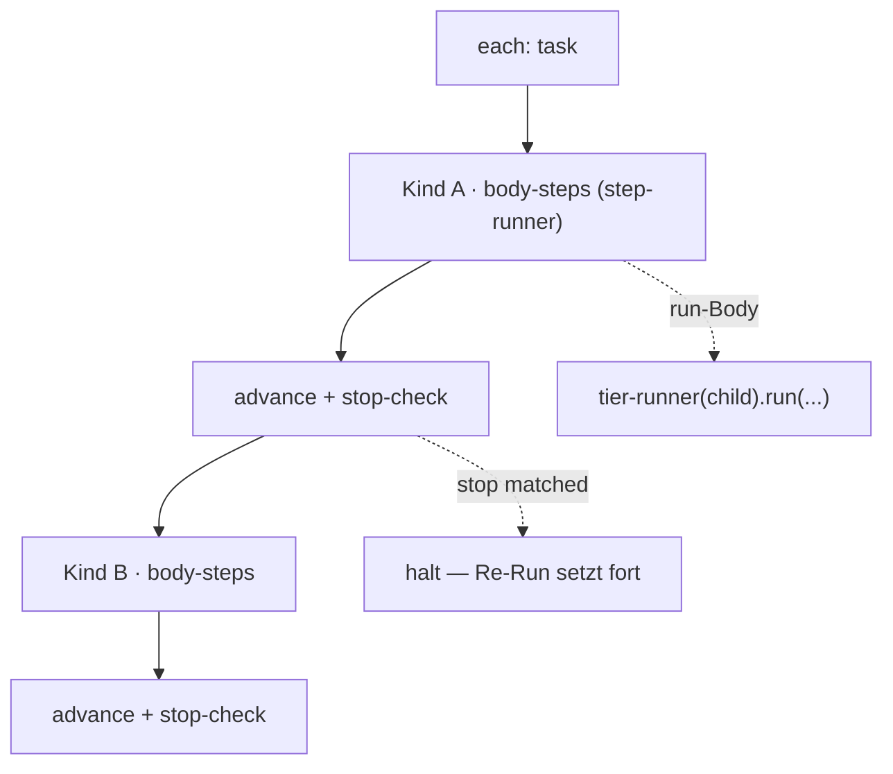

← [engine](../_engine.md)

# loop-step

Helfer für einen Step mit `each: <tier>` — iteriert über die Kinder eines
Knotens und fährt pro Kind die **Kind-Lifecycle**. Hier schließt sich die
fraktale Rekursion (ruft den [tier-runner](../tier-runner.md) der Kind-Etage).

## Was

- Eingabe: ein Step mit `each: <child-tier>` und optionalem `steps`-**Body**.
- **Interleaved**: pro Kind läuft der ganze Body der Reihe nach, *dann* erst das
  nächste Kind (A→body, B→body, …) — nicht erst Step-1 über alle Kinder.
- Body-Default ist `[run]` = die Kind-Lifecycle fahren; der Body läuft über
  denselben [step-runner](../step-runner.md) (fraktal, eine Ebene tiefer).
- Nach jedem Kind: Status fortschreiben + `stop`-Check — built-in, kein User-Step.
- Kind-Reihenfolge folgt dem DAG ([children](../../ops/scope/children.md)): erster
  `pending`, dessen `depends_on` alle `done` sind. Erster Block → halt (v1
  sequenziell).

## Wie

`each: <tier>` (Kurzform) ≙ `{ name: loop, each: <tier>, steps: [run] }`.

## Warum

Die Per-Kind-Mechanik (spawnen, fortschreiben, stop) gehört ins Built-in, damit
sie atomar pro Iteration bleibt; custom Steps reihen sich im Body interleaved
dazwischen. So ist „pro Task: fahren → committen" ausdrückbar, ohne die Integrität
des Loops aufzugeben.
