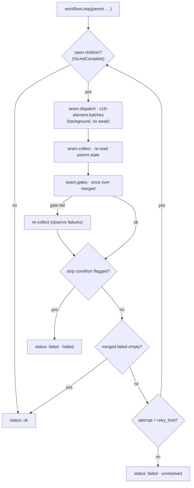

← [engine](../_engine.md)

# loop-workflow

The **WORKFLOW mode** of the loop step — the sibling of
[loop-step](loop-step.md). Where the sequential loop runs an interleaved body *per
child*, this one fans out the open children as a **background workflow**
(≤16-element batches), gathers the evidence back from the task-file state, and runs
the wrap gates **once** over the merged result. Runs behind the injected
`WorkflowSeam` → the whole path is fakeable (no real Claude Code workflow in the
test).

## What

Three guarantees mirror the sequential path exactly:

- **stop conditions halt the loop** — if a child flags a `stop` rule via its
  `failures`, the loop aborts after the collect (`status: 'failed'`).
- **failing children retry** up to `retry_limit` (default 3); children already
  green are skipped in the next round.
- **The hard invariant stays in the substrate** — the gates *never* bypass "no
  `ac→done` without `evidence`".

Evidence-driven, not workflow-resume-dependent: `isUnitComplete` counts a child as
finished only when it is `done` *or* every acceptance criterion is `done` **with**
`evidence`.
Exports: `WORKFLOW_CAP` (16), `selectWorker`, `isUnitComplete`, `partition`,
`workflowLoop`.

## How

`workflowLoop(parent, childTier, cfg, seam) → StepResult`. Worker choice follows the
child's `executor` field: `executor=workflow` → workflow worker, otherwise →
implement worker (`selectWorker`). Without `seam` it is a no-op (`status: 'ok'`).

`partition(children)` splits the gathered children by evidence into `done` vs
`failed`; `CHILD_FIELD` maps the tier to its child array (`phase→phases`,
`task→tasks`, `epic→epics`).

## When

Kicks in during the `build` step of a node whose loop runs in workflow mode (Task
workflow-mode) — the fan-out alternative to the interleaved [loop-step](loop-step.md).
The mode choice + `stop`/`retry_limit` come from the `build` stage config.
