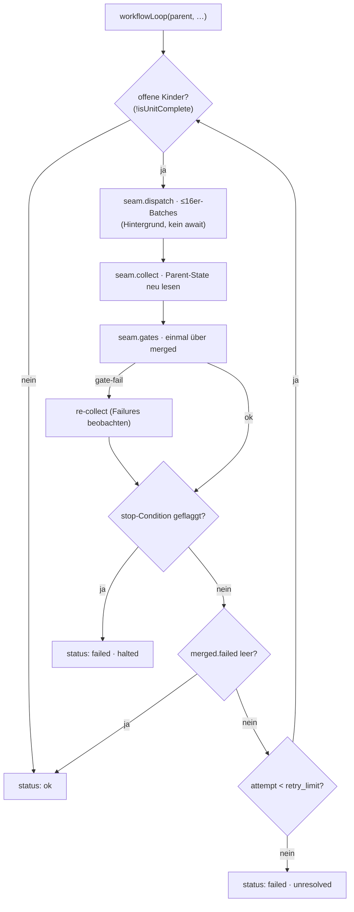

← [engine](../_engine.md)

# loop-workflow

Der **WORKFLOW-Modus** des Loop-Steps — die Schwester von
[loop-step](loop-step.md). Wo der sequentielle Loop einen interleavten Body *pro
Kind* fährt, fanned dieser die offenen Kinder als **Hintergrund-Workflow** aus
(≤16er-Batches), sammelt die Evidence aus dem Task-File-State wieder ein und fährt
die wrap-Gates **einmal** über das gemergte Ergebnis. Läuft hinter der injizierten
`WorkflowSeam` → der ganze Pfad ist fakebar (kein echter Claude-Code-Workflow im
Test).

## Was

Drei Garantien spiegeln den sequentiellen Pfad exakt:

- **stop-Conditions halten den Loop** — flaggt ein Kind über seine `failures` eine
  `stop`-Regel, bricht der Loop nach dem Collect ab (`status: 'failed'`).
- **fehlschlagende Kinder retryen** bis `retry_limit` (Default 3); bereits grüne
  Kinder werden in der nächsten Runde übersprungen.
- **Die harte Invariante bleibt im Substrat** — die Gates umgehen *nie* „kein
  `ac→done` ohne `evidence`".

Evidence-getrieben, nicht workflow-resume-abhängig: `isUnitComplete` zählt ein Kind
nur als fertig, wenn es `done` ist *oder* jedes AC `done` **mit** `evidence` trägt.
Exports: `WORKFLOW_CAP` (16), `selectWorker`, `isUnitComplete`, `partition`,
`workflowLoop`.

## Wie

`workflowLoop(parent, childTier, cfg, seam) → StepResult`. Worker-Wahl folgt dem
`executor`-Feld des Kindes: `executor=workflow` → workflow-Worker, sonst →
implement-Worker (`selectWorker`). Ohne `seam` ist es ein No-op (`status: 'ok'`).

`partition(children)` teilt die eingesammelten Kinder per Evidence in `done` vs
`failed`; `CHILD_FIELD` mappt den Tier auf sein Kind-Array (`phase→phases`,
`task→tasks`, `epic→epics`).

## Wann

Greift im `build`-Step eines Knotens, dessen Loop im Workflow-Modus läuft (Task
workflow-mode) — die fan-out-Alternative zum interleavten [loop-step](loop-step.md).
Die Modus-Wahl + `stop`/`retry_limit` kommen aus der `build`-Stage-Config.
