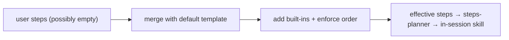

← [engine](../_engine.md)

# resolve-steps

Prepares a stage's `steps` list before the run: inserts the built-in defaults
from the default template, enforces their canonical order, and merges
`instructions`. Here — not in the [step schema](../../schema/_schema.md) — is
where the built-in semantics live.

## What

- Input: the stage's (possibly empty/partial) `steps` + the default-template
  entry for this tier/stage. Output: the effective, ordered step list.
- Missing **mandatory built-ins** are added at their canonical position
  (not removable); custom steps interleave in between.
- Built-ins keep their relative order (e.g. `task-validate` never before
  `implement`); a reserved name with `run`/`use` → error.
- `instructions` on a built-in are **appended** to its default brief
  (extend-only).

## How

## Why

Separates mechanics (which built-ins, which order — fixed) from policy (own
steps + instructions — free). Beginners write nothing and get the canonical
sequence; power users interleave without being able to remove the built-ins.
